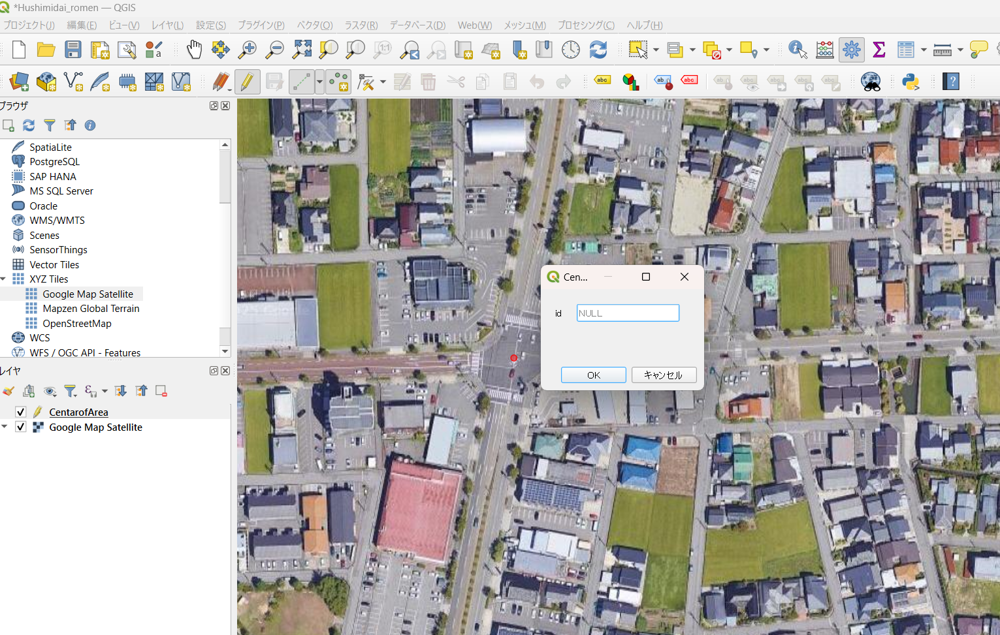

# QGISを用いた航空写真の分割

この記事では，実際の街路を再現したドライビングシミュレータ構築のために，現地の航空写真を指定のサイズで分割して取得することを試みます．

## この記事で説明すること
この記事では以下のことを説明します．
- QGISのレイヤに衛星画像を使用する方法
- 衛星画像に指定サイズのメッシュを重ね合わせる方法．

## この記事の参考サイト
この記事は以下のサイトを参考にしたものです．

> [GISソフト（QGIS)でGoogle Mapなどの汎用地図をプラグインする方法．](https://qiita.com/nigo1973/items/cb023983a498bcf8e73f)

> [メッシュ状の矩形を作成し色分けする方法](https://qiita.com/s-mizumoto/items/46a7561f5be00ea448b0)


## 手順

1. QGISを起動して，新規プロジェクトを作成する．
2. ブラウザウィンドウの `XYZ Tiles` を右クリックして， `新規接続` を選択する．

    
    
3. 立ち上がったウィンドウで，任意の名前を設定する．
4. また，URLの枠には，以下を貼り付ける．
    
    ```plain text
    https://www.google.com/maps/vt?lyrs=s@189&gl=cn&x=%7Bx%7D&y=%7By%7D&z=%7Bz%7D
    ```
    

5.  `OK` を選択して，ウィンドウを閉じる．
6. ブラウザウィンドウの `XYZ Tiles` に先ほど設定した名前( `Google Map Satellite` )の背景地図が追加されているので，ダブルクリックでプロジェクトに追加する．
    


    
7. レイヤタブで `レイヤを作成` > `新規シェープファイルレイヤ` を選択する．

    

    
8. 立ち上がったウィンドウで以下の項目を編集する．
    - 適当なファイル名を設定する．
    - ジオメトリ型は `ポイント` にする．
    - プロジェクトに設定しているのと同一のCRSを指定する．

        

        
9. レイヤウィンドウにポイントレイヤが追加される．

    

    
10. 追加したポイントレイヤを選択して，右クリックし，編集モードに切り替える．
    
    

    
11. 続いて，編集タブから，`点地物を追加する` を選択する．
    
    

    
12. 模造したい交差点の中央付近にポイントを置く．
    
    

    
13. 追加したポイントレイヤを右クリックし， `現在の編集` > `選択レイヤを保存` を選択する．
    
    

14. もう一度ポイントレイヤを右クリックし， `現在の編集` > `選択レイヤの編集キャンセル` を選択して，編集モードを抜ける．
    
    

14. プロセシングタブで， `ツールボックス` を選択する．
    
    

    
15. プロセシングツールボックスウィンドウで， `ベクタジオメトリ` > `長方形・楕円・ダイヤモンド` を選択する．
    
    

    
16. 立ち上がったウィンドウで以下の項目を編集する．
    - 入力レイヤは交差点中央に置いたポイントレイヤを選択する．
    - Shapeは `四角形`
    - 幅と高さは，2km四方にメッシュを作成したいので，`2000m`とする．
        
    
        
17. 追加されたポリゴンレイヤのシンポロジで透明度を調整して，2km四方の正方形が追加されたことを確認する．
    
    
    
18. 続いて，プロセシングツールボックスで `ベクタ作成` > `規則的点群（regular points）` を選択する．
    
    
    
19. 立ち上がったウィンドウで以下の項目を編集する．
    - 矩形範囲は `レイヤから選択` を選択して，メッシュ作成範囲のポリゴンを選択する．
    - 点の間隔/数は，100m四方のメッシュに分割するので，`100m`とする．
    - 出力の座標参照系は，プロジェクトに設定しているのと同一のCRSを指定する．
        
    
        
20. 規則的に並んだ点群が生成される．
    
    
    
21. 最後に，ベクタタブで`バッファ（buffer）` を選択する．
    
    

    
22. 立ち上がったウィンドウで以下の項目を編集する．
    - 入力レイヤは前項で生成した規則的点群のレイヤを選択する．
    - 距離は，`50m`とする．
    - 線端スタイルは，`Square` とする．
        
    

        
23. 生成されたポリゴンのシンポロジを編集して，地図上にメッシュ境界が示されるようにする．
    
    
    
24. 対象交差点周辺の適当な範囲を画像として出力する．
24. その後，描画した100mメッシュの区画線に沿って画像をトリミングしていけば，100mメッシュの衛星画像が完成する．
