# 路面標示の再現

[前回の記事](./divide_photography.md)では，QGISを使ってGoogleの衛星画像を100mメッシュに分割しました．

今回の記事はこの衛星画像を使って，市街地を再現するための地面を作っていきます．

## この記事で説明すること

この記事では以下のことを説明します．
- 地面に使用する画像を作成する方法
- 画像をUnityの地面として使用する方法

## 参考サイト

> [第4回目：オブジェクトにマテリアルやテキスチャを適用する（後編）](https://book.mynavi.jp/manatee/detail/id=59718)

## 手順
まずは，衛星画像をPowerPointでイラスト化します．

1. PowerPointで新しいプレゼンテーションを立ち上げます．
2. `デザイン`タブで`スライドのサイズ`を選択して，スライドを適当なサイズの正方形に変更する．
3. `デザイン`タブで`背景の書式設定`を選択します．
4. 背景の書式設定ウィンドウで，`塗りつぶし（図またはテクスチャ）`を選択します．
5. 画像ソースの`挿入する`を選択して，分割した航空写真を選択すると，パワーポイントの背景画像にその画像が設定されます．
6. 背景に設定した画像に合わせて，適当な図形を組み合わせながら，衛星画像をイラスト化します．
    - 交差点の隅切りはPowerPointのデフォルト図形の `三日月`や`三角形`を利用します．
    - 沿道の建物はおおよそ正しい位置に正しいサイズで配置したいです．そのために，沿道にある建物の位置やサイズも`長方形`等を活用して，記録しておくと良いです．
    - 歩道上の街路樹や植え込みもおおよそ正しい位置に正しいサイズで配置したいです．沿道の建物と同様に，`長方形`や`楕円`等を活用して，サイズや位置を記録しておくと良いです．

今回は，模造対象の交差点の東西方向の道路約1300m（東側約950m，西側350m），南北方向の道路約300mをイラスト化しました．
作成した画像は本リポジトリのPlane_Figureフォルダ内で公開しています．
また，完成した100m四方のイラストを計15枚つなぎ合わせた画像がこちらです．    

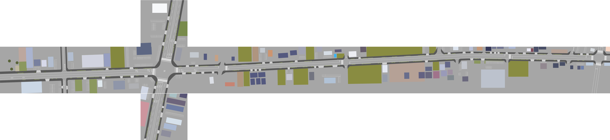

続いて，作成したイラストをUnityの世界の地面に設定します．

7. Unityの新規プロジェクトを起動します．
8. `GameObject` > `3D Object` > `Plane` の順に選択して，平らな板を追加します．以降，これを今回模造する市街地の地面とします．
9. Inspectorウィンドウで地面のサイズや位置を設定します．
    - 地面のscaleは正方形になるように調整します．
    - 上記で作成した100m四方分のイラストを貼り付けて1区画の地面とします．
    - 下記の設定では，Scaleを`10`に設定しています．このとき，Planeの一辺は，Unityの世界上で100m距離になります．Unityの距離1unitは現実世界の1mに相当するため，このような設定を施しています．
        
        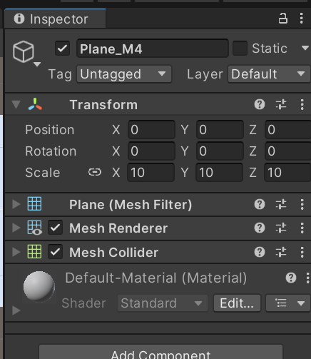

        
10. 上記で衛星画像をイラスト化させたエリア分だけ地面を追加し，敷き詰めておきます．
    
    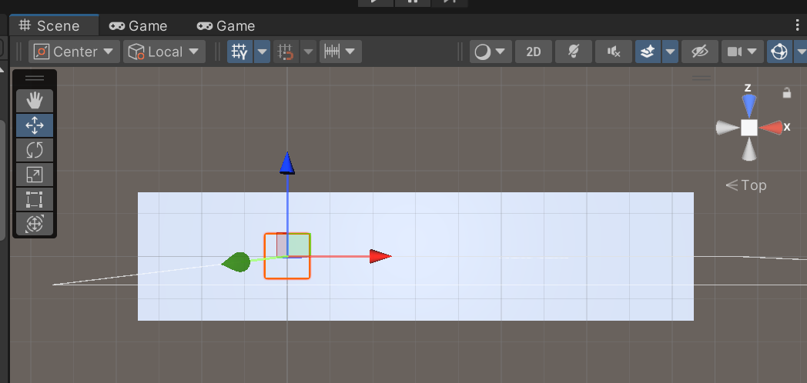

    
11. `Assets` > `Create` > `Material`の順に選択して新規マテリアルを作成します．
    
    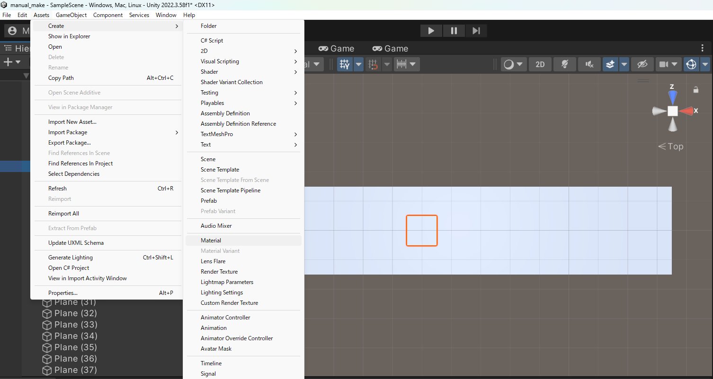
    
12. Projectウィンドウに新規マテリアルが追加されるので，適当な名前をつけます．
    
    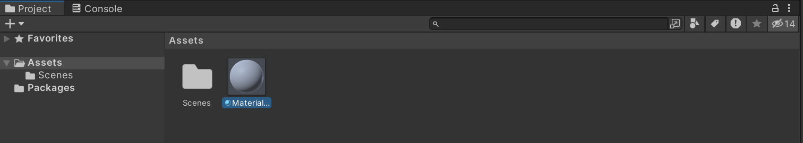
    
13. 新たに作成したマテリアルを右クリックし，`Import New Assets`を選択します．さらに，作成した地面のイラストを選択します．
    
    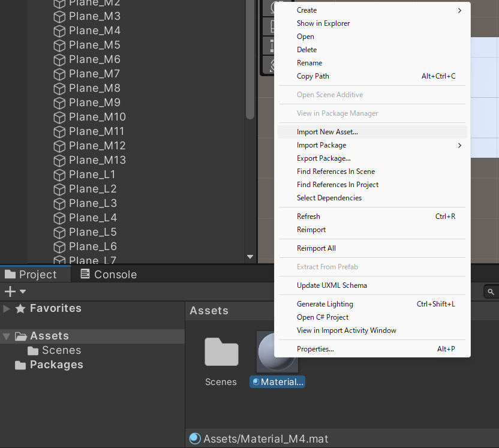
    
14. Projectウィンドウで，作成した路面標示の画像が追加されたことを確認できます．
    
    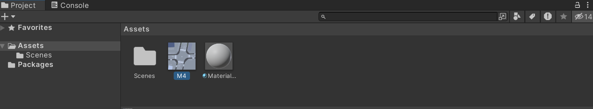

15. 作成した新規マテリアルのInspectorウィンドウのShaderを`Standard`から `Diffuse（Legacy Shaders）`に変更します．
    
    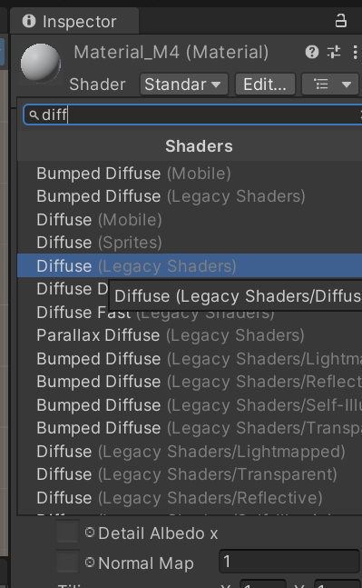

16. Inspectorウィンドウ内のTexture Selectが`None`になっているところに，Projectウィンドウから作成した路面標示の画像をドラッグ&ドロップします．これで，特定の画像をマテリアルにすることができました．
    
    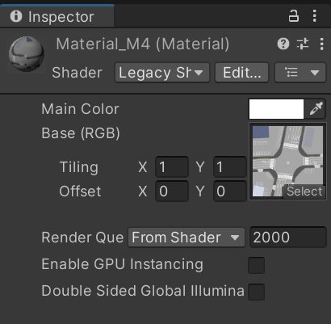

    
17. 新規作成したマテリアルに路面表示のテクスチャが適用されるので，作成した地面にこのマテリアルをドラッグ&ドロップします．
    
    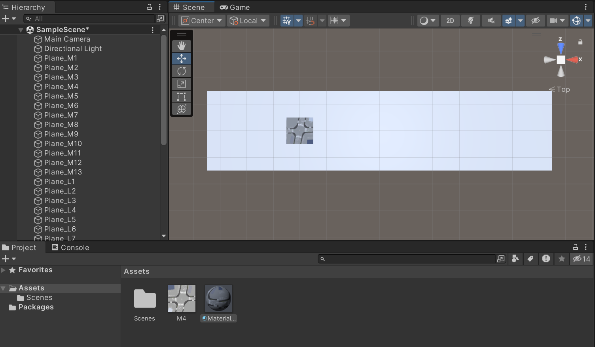

18. 他のPlaneオブジェクトに対しても同様の作業を行うと，下の画像のようになります．残った白色のPlaneパネルは灰色に変更するなどしておくと良いかもしれません．

    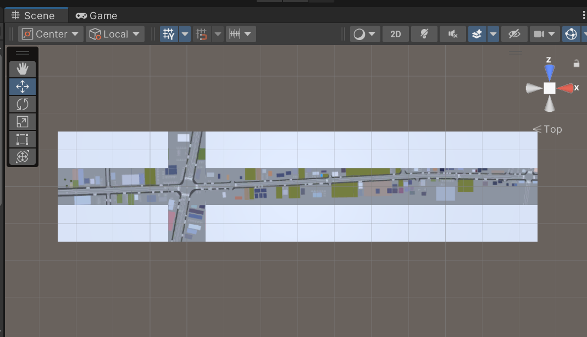

 

