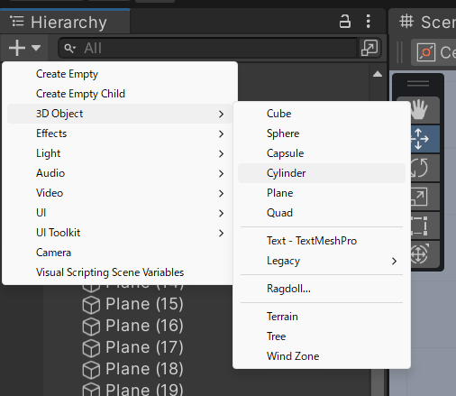
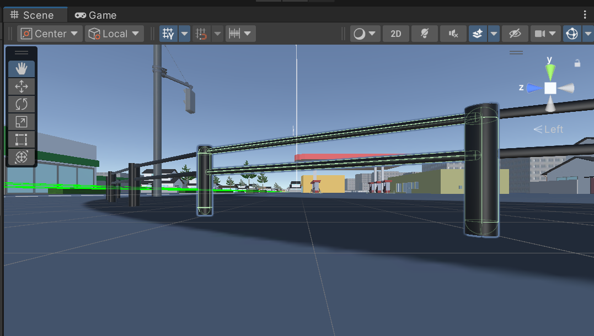
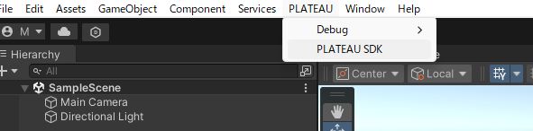
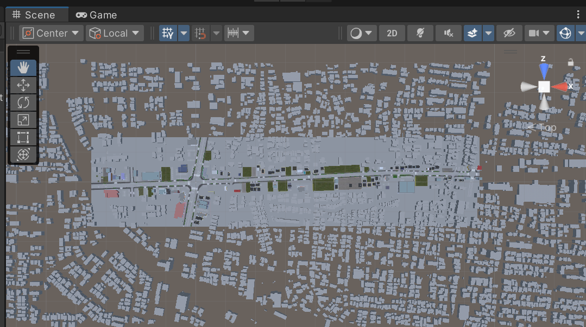
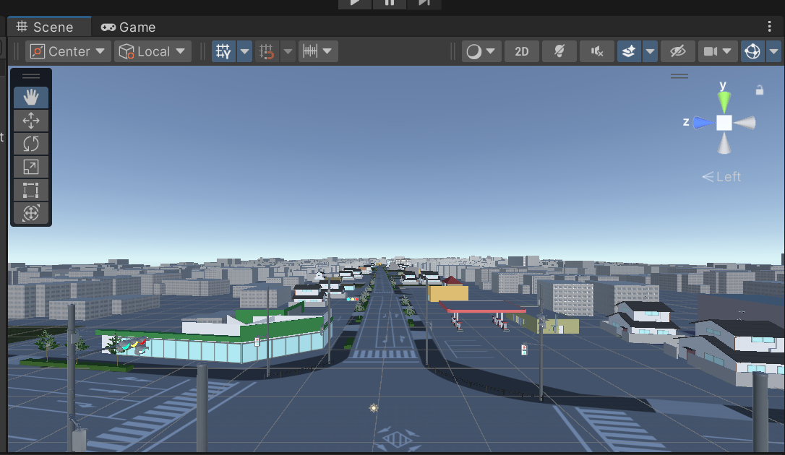

# 建築物と道路付属物の模造

[前回の記事](./imitate_RoadMarking.md)では分割した衛星画像から地面となるイラストを作成し，UnityのPlaneオブジェクトに貼り付けました．

今回は地面の上に建物を配置していきます．

 ## この記事で説明すること
 この記事では以下のことを説明します．
 - Unityのアセット等を用いた市街地の再現方法
 - PLATEAUの3D都市モデルを用いた市街地の再現方法
 
 ## 参考サイト

> [【Unity 入門】Unity アセットストア（Asset Store） とは？使い方解説]( https://styly.cc/ja/tips/asset-store/)

>[アセットのインポート](https://docs.unity3d.com/ja/560/Manual/ImportingAssets.html)

> [17.1 _ PLATEAU SDK for Unityとは](https://www.mlit.go.jp/plateau/learning/tpc17-1/#p17_1)

> [国土交通省が主導するPLATEAUをUnityで使ってみた](https://techceed-inc.com/engineer_blog/9503/)

>[【初心者向け】Unityのオブジェクトの色を変える方法（マテリアルを使用）](https://shibuya24.info/entry/unity-material)

> [第4回目：オブジェクトにマテリアルやテキスチャを適用する（後編）](https://book.mynavi.jp/manatee/detail/id=59718)
 
 ## 手順
 以下では2つの方法をご説明します．
 著者は，沿道の建物は前者の方法，沿道にない建物は後者の方法を利用しました．
 
 ### Unityの既成のアセット等を利用する
 Unityのアセットストアには多種多様なアセットが公開されています．
 市街地を再現するためのアセットも例外ではありません．
 ここでは，市街地を再現するのに有用なアセットや3Dモデルをご紹介します．
 
 #### [Mytown](https://assetstore.unity.com/packages/3d/environments/landscapes/mytown-177012)

本アセットはUnityのアセットストアで公開されているアセットです．
住宅や道路，電柱，公園などのモデルが用意されています．
壁や屋根，窓，扉等を個別に移動，拡大縮小，回転できるため，柔軟に様々な建物を再現できます．
著者は，沿道の住宅や店舗を再現するのに用いました．

 #### [CITY package](https://assetstore.unity.com/packages/3d/environments/urban/city-package-107224)

 このアセットには市街地を再現するための多彩な建物やオブジェクトが収録されています．
 著者は，ガソリンスタンド，マンション，樹木，生け垣，飲食店，スーパーマーケットの再現に，本アセットのモデルを活用しました．
洋風建築が中心となっているため，再現したい地域の特性によっては合わない場合もありますが，多種多様なモデルが取り揃えられているので，プロジェクトに適したものはぜひ活用してください．

 #### 3D Object
 Unityのプロジェクトにデフォルトで用意されているオブジェクトを使用して作成できるものもあります．
 著者は，畑部分の地面，歩道の柵，店舗の看板を，**Cube**と**Cylinder**で再現しました．
 - 畑部分の地面
     1. Hierarchyウィンドウの`+`マークがついたプルダウンメニューから，`3D Object` > `Cube`を選択します．
        
     1. 位置やScaleを調整して，畑部分に合わせます．
     1. [Terrain Textures Pack Free](https://assetstore.unity.com/packages/2d/textures-materials/nature/terrain-textures-pack-free-139542)から取得したテクスチャを貼り付けます．
 - 歩道の柵
     1. Hierarchyウィンドウの`+`マークがついたプルダウンメニューから，`3D Object` > `Cylinder`を選択します．
     1. サイズや位置を調整します．
     1. [こちらの記事](https://shibuya24.info/entry/unity-material)を参考に，**Cylinder**オブジェクトの色を適当に変更します．
     1. 以下の画像のようなものを作ることができます．
        
 - 店舗の看板
    1. 上記と同様の方法で，**Cube**オブジェクトと**Cylinder**オブジェクトをシーンに追加します．
    1. **Cube**オブジェクトは看板本体となるように，**Cylinder**オブジェクトは看板のポールとなるように，位置やサイズを調整します．
    1. 看板の**Cube**オブジェクトには，ネット上から取得してきた当該店舗の看板の画像を，[こちらの記事](https://book.mynavi.jp/manatee/detail/id=59718)の方法でマテリアルとして貼り付けると良いと思います．

#### ゼンリンが提供する3D都市モデルアセット

> [Japanese Dosanko City](https://assetstore.unity.com/packages/3d/environments/urban/japanese-dosanko-city-36810)

> [Japanese Otaku City](https://assetstore.unity.com/packages/3d/environments/urban/japanese-otaku-city-20359)

> [Japanese Matsuri City](https://assetstore.unity.com/packages/3d/environments/urban/japanese-matsuri-city-35619)

著者は利用していませんが，株式会社ゼンリンが提供する無料の3D都市モデルアセットです．
建物だけではなく，自動車や道路標識，信号機も用意されている非常に使い勝手の良いアセットです．

#### 信号機の3Dモデル

> [信号機 / Traffic light](https://a-j-nefsi.booth.pm/items/3337672)

アセットストアで配布されているUnityの無料アセットには，日本国内で利用されている信号機のリアルなモデルは存在しません．
そこで，ネット上で販売されているモデルを購入して使用することにしました．
購入したモデルは，他のアセット同様に，Projectウィンドウにドラッグ&ドロップすることで，プロジェクトに取り込むことができます．

 ### PLATEAUの3Dモデルを利用する

PLATEAUは国土交通省が推進する3D都市モデルデータの整備事業です．
ここでは，PLATEAUの3DモデルをUnityのプロジェクトに取り込む方法について説明します．

1. まずは，[PLATEAU SDK for Unity](https://assetstore.unity.com/packages/tools/utilities/plateau-sdk-for-unity-245703)をアセットストアからダウンロードし，プロジェクトに取り込みます．    
3. 上部タブバーにPLATEAUが追加されるので，`PLATEAU` > `PLATAU SDK`の順に選択します．

    

5. 新たにウィンドウが立ち上がるので，入力フォルダの`参照`をクリックして，対象都市のCityGML形式の都市モデルデータを含むフォルダを指定します．都市モデルデータは，事前に，[G空間情報センターのHP](https://www.geospatial.jp/ckan/dataset/plateau)からダウンロードし，展開しておいてください．
6. 基準座標系を適当なものに設定し，マップ選択範囲の`範囲選択`をクリックします．
6. Sceneビューに対象都市のマップが表示されるので，モデルを取り込みたいメッシュを選択します．選択が完了したら，`決定`をクリックして，範囲選択を終了します．

    

7. 地物別設定で必要なものを選択する．一般設定の`テクスチャ`と，`建築物`はインポートすることをおすすめします．
8. `モデルをインポート`をクリックして，都市モデルをインポートする．
8. インポートされたモデルの位置やサイズを適宜調整する．

以上で，Unityのプロジェクト内に，市街地を再現することができました．
完成した都市は下の画像のようになりました．

次回以降の記事では，自車の配置と操作設定を行います．
