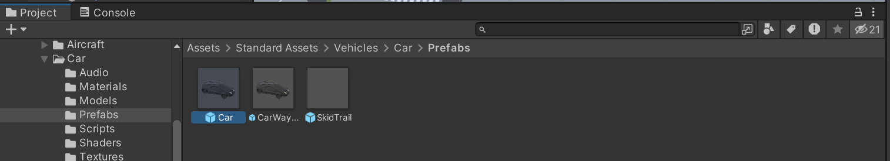

# 自車の挙動とハンコンの入力の連動

[前回の記事](./1_3.md)までは，走行環境として仮想空間内に街路の模造を行ってきました．

今回は，自車の配置と制御の方法を説明します．
具体的には，Standard Assetsの車両を導入し，キー操作，もしくはハンドルコントローラで制御できるようにします．

## この記事で説明すること
この記事では以下を説明します．
- UnityのStandard Assetsをダウンロードし，プロジェクトに取り込む方法
- Standard Assetsの車両をキー操作で運転する方法
- ハンドルコントローラ（Logitech G29）をUnityと連携させる方法
- ハンドルコントローラ（Logitech G29）で車両を制御する方法

## 参考サイト

> [超便利なStandard Assetsを使ってみた！(Unity 2022.3.22f1)](https://qiita.com/2001at/items/79c6be15213bbb09c276)

> [Logitech G29を使うためにLogitechSDKをセットアップ-Unity](https://fujiya228.com/unity-logitech-g29-setup/)

> [Logitech G29 SteeringWheel PCでUnityできるまで](https://qiita.com/mmt/items/4de0646118c37c952b19)

> [Logitech G29を使って車を走らす-Unity](https://fujiya228.com/unity-logitech-g29-car-controll/)

## 手順

### Standard AssetsのCarプレハブの導入
Unity Standard Assetsは公式からのサポートがすでに終了しており，アセットストアから削除されてしまっているそうです．
そこで，GitHubからアセットをダウンロードし，プロジェクトに取り込みたいと思います．

1. まずは，[こちらのページ](https://github.com/jamschutz/Unity-Standard-Assets.git)で公開されているStandard Assetsをダウンロードします．
2. ダウンロードしてきたファイルを展開します．
3. Standard Assets/Utility/直下の4つのファイルを削除する．
    - SimpleActivatorMenu.cs
    - SimpleActivatorMenu.cs.meta
    - ForcedReset.cs
    - ForcedReset.cs.meta
4. 以上の変更を加えたStandard Assetsのフォルダをプロジェクトに取り込みます．
4. Projectウィンドウで，`Assets` > `Standard Assets` > `Vehicles` > `Car` > `Prefabs` の順に選択して，直下にある`Car.prefab`をドラッグ&ドロップでSceneに配置します．
    
    

4. 位置や向き，大きさを適宜調整します．
    
    

4. また，`Main Camera`の位置も，配置した車両が見える位置に変更します．
    

4. この状態でウィンドウ上部の`▶`ボタンでゲームを実行します．配置した車両が，キーボードの`W` `A` `S` `D`キー，もしくは，`↑` `←` `↓` `→`キーの入力に従って動くようになっていることを確認してください．


### ハンコンの操作との連携

#### PCへの接続とソフトウェアのインストール

1. まずは，コントローラの説明書に従って，コントローラをPCと電源に接続します．
2. [公式ページ](https://gaming.logicool.co.jp/ja-jp/innovation/g-hub.html)からLogitech G HUBインストーラをダウンロードします．
3. インストーラを起動し，手順通りに進めて，Logitech G HUBをインストールします．
4. Logitech G HUBを起動します．同ソフトウェアでは，ボタンの割り当てやペダル感度などを調整できます．
    
        

#### ハンドルコントローラ用アセットのインストール

1. Unityアセットストアから[Logitech Gaming SDK](https://assetstore.unity.com/packages/tools/integration/logitech-gaming-sdk-6630)(以降，**ストアSDK**)をダウンロードします．
2. ダウンロードした**ストアSDK**をUnityのプロジェクトに取り込みます．
3. Hierarchyウィンドウ上部の`+`プルダウンから`Create Empty`を選択し，空のゲームオブジェクトを追加します．

    

4. Projectウィンドウで，`Assets` > `Logitech SDK` > `Script Sample`を選択し，直下に存在する `LogitechSteeringWheel.cs`を作成した空のゲームオブジェクトにアタッチします．

    

5. このままゲームの実行を試みると，エラーを吐いて，うまく実行できません．そこで，Logitechの公式ページから修正版SDK(以降，**公式SDK**)をダウンロードします．以下のリンクにアクセスしてください[^1]．
    ``` plain text
    https://gaming.logicool.co.jp/ja-jp/partnerdeveloperlab/sdk-resource-list/steering-wheel-sdk.html
    ```

6. ダウンロードした公式SDKを展開します．
7. ファイルマネージャでダウンロードしてきた**公式SDK**の`"LogitechSteeringWheelSDK_8.75.30\Lib\GameEnginesWrapper\x64”`の直下に移動する．
7. UnityプロジェクトのProjectウィンドウで`Assets` > `Logitech SDK`直下に移動する．
7. **公式SDK**の`LogitechSteeringWheelEnginesWrapper.dll`で，`LogitechSteeringWheelEnginesWrapper.dll`を置き換えます．イメージは下図です[^2]．

    

8. ゲームを実行し，下記画面のように設定されているパラメータやSteeringWheel・ペダルの状態などが表示されることを確認してください．
    
    

9. 確認できたら，`LogitechSteeringWheel.cs`をアタッチしたゲームオブジェクトは削除しておいてください．
 
#### ハンドルコントローラの操作と車両の挙動の連携

ハンドルコントローラとUnityの連携が完了したので，つぎは，Standard Assetsの車両をハンドルコントローラで動かしていきます．

1. Projectウィンドウで，`Assets` > `Standard Assets` > `Vehicles` > `Car` > `Scripts` の順に選択します．`Scripts`フォルダ直下で右クリックし，`Create` > `C#Script` で新規スクリプトを作成します．ファイル名は`CarControllerOriginal.cs`とします．
1. [こちらのサイト](https://fujiya228.com/unity-logitech-g29-car-controll/)に掲載されている以下のスクリプトを貼り付けます．
    <details>
    <summary>CarControllerOriginal.cs</summary>
        ```CarControllerOriginal.cs
        using System;
        using UnityEngine;
        using UnityEngine.UI;
        
        #pragma warning disable 649
        namespace LogitechSDK
        {
            internal enum CarDriveType
            {
                FrontWheelDrive,
                RearWheelDrive,
                FourWheelDrive
            }
        
            internal enum SpeedType
            {   
                MPH,
                KPH
            }
        
            public class CarControllerOriginal : MonoBehaviour
            {
                [SerializeField] private CarDriveType m_CarDriveType = CarDriveType.FourWheelDrive;
                [SerializeField] private WheelCollider[] m_WheelColliders = new WheelCollider[4];
                [SerializeField] private GameObject[] m_WheelMeshes = new GameObject[4];
                [SerializeField] private Vector3 m_CentreOfMassOffset;
                [SerializeField] private float m_MaximumSteerAngle = 10;
                [Range(0, 1)] [SerializeField] private float m_SteerHelper = 1; // 0 is raw physics , 1 the car will grip in the direction it is facing
                [Range(0, 1)] [SerializeField] private float m_TractionControl = 1; // 0 is no traction control, 1 is full interference
                [SerializeField] private float m_FullTorqueOverAllWheels = 2500;
                [SerializeField] private float m_ReverseTorque = 1500;
                [SerializeField] private float m_MaxHandbrakeTorque = 100000000;
                [SerializeField] private float m_Downforce = 100f;
                [SerializeField] private SpeedType m_SpeedType;
                [SerializeField] private float m_Topspeed = 200;
                [SerializeField] private float m_SlipLimit = 10;
                [SerializeField] private float m_BrakeTorque = 20000;
                // original
                [SerializeField] private float footbrake_th=0.15f; // 時々ペダルが戻りきらなくなる結果、常に踏んだ状態となる。止まりっぱなしになるのを避けるため
        
                private Quaternion[] m_WheelMeshLocalRotations;
                private Vector3 m_Prevpos, m_Pos;
                private float m_SteerAngle;
                private float m_GearFactor;
                private float m_OldRotation;
                private float m_CurrentTorque;
                private Rigidbody m_Rigidbody;
                private const float k_ReversingThreshold = 0.01f;
        
                public bool Skidding { get; private set; }
                public float BrakeInput { get; private set; }
                public float CurrentSteerAngle{ get { return m_SteerAngle; }}
                public float CurrentSpeed{ get { return m_Rigidbody.velocity.magnitude*2.23693629f; }}
                public float MaxSpeed{get { return m_Topspeed; }}
                public float Revs { get; private set; }
                public float AccelInput { get; private set; }
        
                // Use this for initialization
                private void Start()
                {
                    m_WheelMeshLocalRotations = new Quaternion[4];
                    for (int i = 0; i < 4; i++)
                    {
                        m_WheelMeshLocalRotations[i] = m_WheelMeshes[i].transform.localRotation;
                    }
                    m_WheelColliders[0].attachedRigidbody.centerOfMass = m_CentreOfMassOffset;
        
                    m_MaxHandbrakeTorque = float.MaxValue;
        
                    m_Rigidbody = GetComponent<Rigidbody>();
                    m_CurrentTorque = m_FullTorqueOverAllWheels - (m_TractionControl*m_FullTorqueOverAllWheels);
                }
        
                public void Move(float steering, float accel, float footbrake, float handbrake)
                {
                    for (int i = 0; i < 4; i++)
                    {
                        Quaternion quat;
                        Vector3 position;
                        m_WheelColliders[i].GetWorldPose(out position, out quat);
                        m_WheelMeshes[i].transform.position = position;
                        m_WheelMeshes[i].transform.rotation = quat;
                    }
        
                    //clamp input valuesFR
                    steering = Mathf.Clamp(steering, -1, 1);
                    AccelInput = accel = Mathf.Clamp(accel, -1, 1);
                    BrakeInput = footbrake = Mathf.Clamp(footbrake, 0, 1);
                    handbrake = Mathf.Clamp(handbrake, 0, 1);
        
                    //Set the steer on the front wheels.
                    //Assuming that wheels 0 and 1 are the front wheels.
                    m_SteerAngle = steering*m_MaximumSteerAngle;
                    m_WheelColliders[0].steerAngle = m_SteerAngle;
                    m_WheelColliders[1].steerAngle = m_SteerAngle;
        
                    SteerHelper();
                    ApplyDrive(accel, footbrake);
                    CapSpeed();
        
                    //Set the handbrake.
                    //Assuming that wheels 2 and 3 are the rear wheels.
                    if (handbrake > 0f)
                    {
                        var hbTorque = handbrake*m_MaxHandbrakeTorque;
                        m_WheelColliders[2].brakeTorque = hbTorque;
                        m_WheelColliders[3].brakeTorque = hbTorque;
                    }
        
                    AddDownForce();
                    TractionControl();
                }
        
                private void CapSpeed()
                {
                    float speed = m_Rigidbody.velocity.magnitude;
                    switch (m_SpeedType)
                    {
                        case SpeedType.MPH:
        
                            speed *= 2.23693629f;
                            if (speed > m_Topspeed)
                                m_Rigidbody.velocity = (m_Topspeed/2.23693629f) * m_Rigidbody.velocity.normalized;
                            break;
        
                        case SpeedType.KPH:
                            speed *= 3.6f;
                            if (speed > m_Topspeed)
                                m_Rigidbody.velocity = (m_Topspeed/3.6f) * m_Rigidbody.velocity.normalized;
                            break;
                    }
                }
        
                private void ApplyDrive(float accel, float footbrake)
                {
        
                    float thrustTorque = 0;
                    switch (m_CarDriveType)
                    {
                        case CarDriveType.FourWheelDrive:
                            thrustTorque = accel * (m_CurrentTorque / 4f);
                            for (int i = 0; i < 4; i++)
                            {
                                m_WheelColliders[i].motorTorque = thrustTorque;
                            }
                            break;
        
                        case CarDriveType.FrontWheelDrive:
                            thrustTorque = accel * (m_CurrentTorque / 2f);
                            m_WheelColliders[0].motorTorque = m_WheelColliders[1].motorTorque = thrustTorque;
                            m_WheelColliders[2].motorTorque = m_WheelColliders[3].motorTorque = 0;
                            break;
        
                        case CarDriveType.RearWheelDrive:
                            thrustTorque = accel * (m_CurrentTorque / 2f);
                            m_WheelColliders[0].motorTorque = m_WheelColliders[1].motorTorque = 0;
                            m_WheelColliders[2].motorTorque = m_WheelColliders[3].motorTorque = thrustTorque;
                            break;
        
                    }
        
                    // ブレーキ部分
                    // 速度や向きによってブレーキのかけ方を変えている
                    float Angle = Vector3.Angle(transform.forward, m_Rigidbody.velocity); // 車体正面と速度の方向のなす角
                    float curtBrakeTorque;
                    float addMotorTorqueValue;
                    if (footbrake > footbrake_th){
                        if (CurrentSpeed > 1) // 速度が５より大きい
                        {
                            curtBrakeTorque = 0f;
                            if (Angle < 50f) { // 前方に（左右50度ずつの範囲）に進んでいる
                                addMotorTorqueValue = -m_ReverseTorque*footbrake;
                            } else { // 後方に進んでいる
                                addMotorTorqueValue = m_ReverseTorque*footbrake;
                            }
                        } else { // 速度が５以下
                            curtBrakeTorque = m_BrakeTorque*footbrake;
                            addMotorTorqueValue = 0f;
                        }
                    } else curtBrakeTorque = addMotorTorqueValue = 0f;
                    for (int i = 0; i < 4; i++)
                    {
                        m_WheelColliders[i].brakeTorque = curtBrakeTorque;
                        m_WheelColliders[i].motorTorque += addMotorTorqueValue;
                    }
                }
        
                private void SteerHelper()
                {
                    for (int i = 0; i < 4; i++)
                    {
                        WheelHit wheelhit;
                        m_WheelColliders[i].GetGroundHit(out wheelhit);
                        if (wheelhit.normal == Vector3.zero)
                            return; // wheels arent on the ground so dont realign the rigidbody velocity
                                    // 地面にないので調整する必要なし
                    }
        
                    // this if is needed to avoid gimbal lock problems that will make the car suddenly shift direction
                    if (Mathf.Abs(m_OldRotation - transform.eulerAngles.y) < 10f)
                    {
                        var turnadjust = (transform.eulerAngles.y - m_OldRotation) * m_SteerHelper;
                        Quaternion velRotation = Quaternion.AngleAxis(turnadjust, Vector3.up);
                        m_Rigidbody.velocity = velRotation * m_Rigidbody.velocity;
                    }
                    m_OldRotation = transform.eulerAngles.y;
                }
        
                // this is used to add more grip in relation to speed
                // タイヤがアタッチされているRigidbodyに下に向けた力を加えグリップを増やす
                private void AddDownForce()
                {
                    m_WheelColliders[0].attachedRigidbody.AddForce(-transform.up*m_Downforce*
                                                                m_WheelColliders[0].attachedRigidbody.velocity.magnitude);
                }
        
                // crude traction control that reduces the power to wheel if the car is wheel spinning too much
                private void TractionControl()
                {
                    WheelHit wheelHit;
                    switch (m_CarDriveType)
                    {
                        case CarDriveType.FourWheelDrive:
                            // loop through all wheels
                            for (int i = 0; i < 4; i++)
                            {
                                m_WheelColliders[i].GetGroundHit(out wheelHit);
        
                                AdjustTorque(wheelHit.forwardSlip);
                            }
                            break;
        
                        case CarDriveType.RearWheelDrive:
                            m_WheelColliders[2].GetGroundHit(out wheelHit);
                            AdjustTorque(wheelHit.forwardSlip);
        
                            m_WheelColliders[3].GetGroundHit(out wheelHit);
                            AdjustTorque(wheelHit.forwardSlip);
                            break;
        
                        case CarDriveType.FrontWheelDrive:
                            m_WheelColliders[0].GetGroundHit(out wheelHit);
                            AdjustTorque(wheelHit.forwardSlip);
        
                            m_WheelColliders[1].GetGroundHit(out wheelHit);
                            AdjustTorque(wheelHit.forwardSlip);
                            break;
                    }
                }
        
                private void AdjustTorque(float forwardSlip)
                {
                    if (forwardSlip >= m_SlipLimit && m_CurrentTorque >= 0)
                    {
                        m_CurrentTorque -= 100 * m_TractionControl;
                    }
                    else
                    {
                        m_CurrentTorque += 100 * m_TractionControl;
                        if (m_CurrentTorque > m_FullTorqueOverAllWheels)
                        {
                            m_CurrentTorque = m_FullTorqueOverAllWheels;
                        }
                    }
                }
            }
        }
        ```
    </details>


3. 同様にして，もう一つ新規スクリプトを作成します．ファイル名はCarUserControlOriginal.csとします．
1. [こちらのサイト](https://fujiya228.com/unity-logitech-g29-car-controll/)に掲載されている以下のスクリプトを貼り付けます．
    <details>
    <summary>CarUserControlOriginal.cs</summary>
    ```CarUserControlOriginal.cs
    using System;
    using UnityEngine;
    
    namespace LogitechSDK
    {
        [RequireComponent(typeof(CarControllerOriginal))]
        public class CarUserControlOriginal : MonoBehaviour
        {
            private CarControllerOriginal m_Car; // the car controller we want to use
    
            private void Awake()
            {
                // get the car controller
                m_Car = GetComponent<CarControllerOriginal>();
                Debug.Log("SteeringInit:" + LogitechGSDK.LogiSteeringInitialize(false));
            }
    
            private void FixedUpdate()
            {
                if (!LogitechGSDK.LogiIsPlaying(0, LogitechGSDK.LOGI_FORCE_SPRING))
                {
                    // ハンドルに中心に向けた力を加えるように設定
                    LogitechGSDK.LogiPlaySpringForce(0, 0, 30, 100);
                }
                if (LogitechGSDK.LogiUpdate() && LogitechGSDK.LogiIsConnected(0))
                {
                    //CONTROLLER STATE
                    LogitechGSDK.DIJOYSTATE2ENGINES rec = LogitechGSDK.LogiGetStateUnity(0);
                    float steering = rec.lX / 32768f;               // ハンドル
                    float accel = rec.lY / 65536f + 0.5f;           // アクセル
                    float brake = rec.lRz / 65536f + 0.5f;          // ブレーキ
                    float back = rec.rglSlider[0] / 65536f + 0.5f;  // バック
                    Debug.Log(steering);
    
    #if !MOBILE_INPUT
                    float handbrake;
                    handbrake = 0; // 今回はハンドブレーキは、なしで
                    if (System.Math.Abs(steering) < 0.01) steering = 0; // 中心に向けた力が加わらない範囲は直進
                    m_Car.Move(steering, 0.6f + back * 0.5f - accel, 1 - brake, handbrake);
    #else
                    m_Car.Move(steering, 1, 0, 0);
    #endif
                }
            }
        }
    }
    ```
    </details>

5. `Assets` > `Logitech SDK`直下に存在する`LogitechGSDK.cs`を，`Assets` > `Standard Assets` > `Vehicles` > `Car` > `Scripts`直下に移動します．
7. Stanard AssetsのCarモデルのInspecterウィンドウを開きます．**Car Audio**コンポーネント，``Car User Control``コンポーネント，``Car Controller``コンポーネントを `Remove Component` で削除します．

    

8. 先ほど作成した，`CarControllerOriginal.cs`と`CarUserControlOriginal.cs`をCarモデルにアタッチします．
    
    

    
9. Hierarchyウィンドウで，Carモデルの直下にある，**Lights**, **Particles**, **Helpers**の3つのオブジェクトを削除します．
    
    

    
10. Hierarchyウィンドウで，`Car` > `WheelHubs`の直下にある4つのオブジェクトにアタッチされている**Audio Source**コンポーネントと**Wheel Effects**コンポーネントを削除します．
    
    

    
11. Hierarchyウィンドウで，`Car` > `SkyCar`の直下にある**SkyCarBrakeLightsGlow**を削除します．
    
    

    
12. Hierarchyウィンドウで，`Car` > `SkyCar`の直下にある**SkyCarMudGuardFrontLeft**と**SkyCarMudGuardFrontRight**を削除する．
    
    

    
13. CarモデルのInspecterウィンドウで．`Wheel Coliders`と`Wheel Meshes`の設定を行います．下記画像のように，それぞれWheel HubsおよびSkyCarからドラッグ&ドロップでアタッチします．
    
    
    
14. 実際にゲームを実行して，コントローラと連携できているか確認します．
14. コントローラの感度を適宜調整します．CarUserCOntroll.csの下記の部分の数値を変更すると，コントローラからの入力値が変化し，操作感度を変更することができます．
```CarUserCOntrollOriginal.cs
    //CONTROLLER STATE
    LogitechGSDK.DIJOYSTATE2ENGINES rec = LogitechGSDK.LogiGetStateUnity(0);
    float steering = rec.lX / 32768f;               // ハンドル
    float accel = rec.lY / 65536f + 0.5f;           // アクセル
    float brake = rec.lRz / 65536f + 0.5f;          // ブレーキ
    float back = rec.rglSlider[0] / 65536f + 0.5f;  // バック
    Debug.Log(steering);
```

今回はハンドルコントローラでStandard AssetsのCarプレハブを操作する方法をご説明しました．
次回以降の記事では，よりリアルな運転環境を作っていこうと思います．

[^1]: 2025年3月現在，上記のリンク先のサイトは存在しないようです．ただし，著者は[過去のページを閲覧できるサービス](https://web.archive.org/)を利用して**公式SDK**をダウンロードすることができました．
[^2]: この作業はプロジェクトごとに行う必要があるので，注意してください．