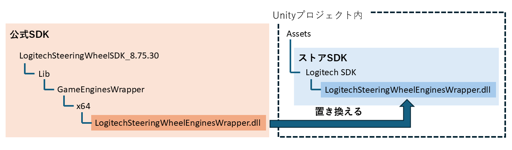

# 自車の挙動とハンコンの入力の連動

[前回の記事](./1_3.md)までは，走行環境として仮想空間内に街路の模造を行ってきました．

今回は，自車の配置と制御の方法を説明します．
具体的には，Standard Assetsの車両を導入し，キー操作，もしくはハンドルコントローラで制御できるようにします．

## この記事で説明すること
この記事では以下を説明します．
- UnityのStandard Assetsをダウンロードし，プロジェクトに取り込む方法
- Standard Assetsの車両をキー操作で運転する方法
- ハンドルコントローラ（Logitech G29）をUnityと連携させる方法
- ハンドルコントローラ（Logitech G29）で車両を制御する方法

## 参考サイト

> [超便利なStandard Assetsを使ってみた！(Unity 2022.3.22f1)](https://qiita.com/2001at/items/79c6be15213bbb09c276)

> [Logitech G29を使うためにLogitechSDKをセットアップ-Unity](https://fujiya228.com/unity-logitech-g29-setup/)

> [Logitech G29 SteeringWheel PCでUnityできるまで](https://qiita.com/mmt/items/4de0646118c37c952b19)

> [Logitech G29を使って車を走らす-Unity](https://fujiya228.com/unity-logitech-g29-car-controll/)

## 手順

### Standard AssetsのCarプレハブの導入
Unity Standard Assetsは公式からのサポートがすでに終了しており，アセットストアから削除されてしまっているそうです．
そこで，GitHubからアセットをダウンロードし，プロジェクトに取り込みたいと思います．

1. まずは，[こちらのページ](https://github.com/jamschutz/Unity-Standard-Assets.git)で公開されているStandard Assetsをダウンロードします．
2. ダウンロードしてきたファイルを展開します．
3. Standard Assets/Utility/直下の4つのファイルを削除する．
    - SimpleActivatorMenu.cs
    - SimpleActivatorMenu.cs.meta
    - ForcedReset.cs
    - ForcedReset.cs.meta
4. 以上の変更を加えたStandard Assetsのフォルダをプロジェクトに取り込みます．
4. Projectウィンドウで，`Assets` > `Standard Assets` > `Vehicles` > `Car` > `Prefabs` の順に選択して，直下にある`Car.prefab`をドラッグ&ドロップでSceneに配置します．
    
    

4. 位置や向き，大きさを適宜調整します．
    
    

4. また，`Main Camera`の位置も，配置した車両が見える位置に変更します．
    

4. この状態でウィンドウ上部の`▶`ボタンでゲームを実行します．配置した車両が，キーボードの`W` `A` `S` `D`キー，もしくは，`↑` `←` `↓` `→`キーの入力に従って動くようになっていることを確認してください．


### ハンコンの操作との連携

#### PCへの接続とソフトウェアのインストール

1. まずは，コントローラの説明書に従って，コントローラをPCと電源に接続します．
2. [公式ページ](https://gaming.logicool.co.jp/ja-jp/innovation/g-hub.html)からLogitech G HUBインストーラをダウンロードします．
3. インストーラを起動し，手順通りに進めて，Logitech G HUBをインストールします．
4. Logitech G HUBを起動します．同ソフトウェアでは，ボタンの割り当てやペダル感度などを調整できます．
    
        

#### ハンドルコントローラ用アセットのインストール

1. Unityアセットストアから[Logitech Gaming SDK](https://assetstore.unity.com/packages/tools/integration/logitech-gaming-sdk-6630)(以降，**ストアSDK**)をダウンロードします．
2. ダウンロードした**ストアSDK**をUnityのプロジェクトに取り込みます．
3. Hierarchyウィンドウ上部の`+`プルダウンメニューから`Create Empty`を選択し，空のゲームオブジェクトを追加します．

    

4. Projectウィンドウで，`Assets` > `Logitech SDK` > `Script Sample`を選択し，直下に存在する `LogitechSteeringWheel.cs`を作成した空のゲームオブジェクトにアタッチします．

    

5. このままゲームの実行を試みると，エラーを吐いて，うまく実行できません．そこで，Logitechの公式ページから修正版SDK(以降，**公式SDK**)をダウンロードします．以下のリンクにアクセスしてください[^1]．
    ``` plain text
    https://gaming.logicool.co.jp/ja-jp/partnerdeveloperlab/sdk-resource-list/steering-wheel-sdk.html
    ```

6. ダウンロードした公式SDKを展開します．
7. ファイルマネージャでダウンロードしてきた**公式SDK**の`"LogitechSteeringWheelSDK_8.75.30\Lib\GameEnginesWrapper\x64”`の直下に移動する．
7. UnityプロジェクトのProjectウィンドウで`Assets` > `Logitech SDK`直下に移動する．
7. **公式SDK**の`LogitechSteeringWheelEnginesWrapper.dll`で，`LogitechSteeringWheelEnginesWrapper.dll`を置き換えます．イメージは下図です[^2]．

    

8. ゲームを実行し，下記画面のように設定されているパラメータやSteeringWheel・ペダルの状態などが表示されることを確認してください．
    
    

9. 確認できたら，`LogitechSteeringWheel.cs`をアタッチしたゲームオブジェクトは削除しておいてください．
 
#### ハンドルコントローラの操作と車両の挙動の連携

ハンドルコントローラとUnityの連携が完了したので，つぎは，Standard Assetsの車両をハンドルコントローラで動かしていきます．

1. Projectウィンドウで，`Assets` > `Standard Assets` > `Vehicles` > `Car` > `Scripts` の順に選択します．`Scripts`フォルダ直下で右クリックし，`Create` > `C#Script` で新規スクリプトを作成します．ファイル名は`CarControllerOriginal.cs`とします．
1. [こちらのサイト](https://fujiya228.com/unity-logitech-g29-car-controll/)に掲載されているCarControllerOriginal.csを貼り付けます．
3. 同様にして，もう一つ新規スクリプトを作成します．ファイル名はCarUserControlOriginal.csとします．
1. [こちらのサイト](https://fujiya228.com/unity-logitech-g29-car-controll/)に掲載されているCarUserControlOriginal.csを貼り付けます．
5. `Assets` > `Logitech SDK`直下に存在する`LogitechGSDK.cs`を，`Assets` > `Standard Assets` > `Vehicles` > `Car` > `Scripts`直下に移動します．
7. Stanard AssetsのCarモデルのInspectorウィンドウを開きます．**Car Audio**コンポーネント，``Car User Control``コンポーネント，``Car Controller``コンポーネントを `Remove Component` で削除します．

    

8. 先ほど作成した，`CarControllerOriginal.cs`と`CarUserControlOriginal.cs`をCarモデルにアタッチします．
    
    

    
9. Hierarchyウィンドウで，Carモデルの直下にある，**Lights**, **Particles**, **Helpers**の3つのオブジェクトを削除します．
    
    

    
10. Hierarchyウィンドウで，`Car` > `WheelHubs`の直下にある4つのオブジェクトにアタッチされている**Audio Source**コンポーネントと**Wheel Effects**コンポーネントを削除します．
    
    

    
11. Hierarchyウィンドウで，`Car` > `SkyCar`の直下にある**SkyCarBrakeLightsGlow**を削除します．
    
    

    
12. Hierarchyウィンドウで，`Car` > `SkyCar`の直下にある**SkyCarMudGuardFrontLeft**と**SkyCarMudGuardFrontRight**を削除する．
    
    

    
13. CarモデルのInspectorウィンドウで．`Wheel Coliders`と`Wheel Meshes`の設定を行います．下記画像のように，それぞれWheel HubsおよびSkyCarからドラッグ&ドロップでアタッチします．
    
    
    
14. 実際にゲームを実行して，コントローラと連携できているか確認します．
14. コントローラの感度を適宜調整します．CarUserCOntrollOriginal.csの下記の部分の数値を変更すると，コントローラからの入力値が変化し，操作感度を変更することができます．
```CarUserCOntrollOriginal.cs
    //CONTROLLER STATE
    LogitechGSDK.DIJOYSTATE2ENGINES rec = LogitechGSDK.LogiGetStateUnity(0);
    float steering = rec.lX / 32768f;               // ハンドル
    float accel = rec.lY / 65536f + 0.5f;           // アクセル
    float brake = rec.lRz / 65536f + 0.5f;          // ブレーキ
    float back = rec.rglSlider[0] / 65536f + 0.5f;  // バック
    Debug.Log(steering);
```

今回はハンドルコントローラでStandard AssetsのCarプレハブを操作する方法をご説明しました．
次回以降の記事では，よりリアルな運転環境を作っていこうと思います．

[^1]: 2025年3月現在，上記のリンク先のサイトは存在しないようです．ただし，著者は[過去のページを閲覧できるサービス](https://web.archive.org/)を利用して**公式SDK**をダウンロードすることができました．
[^2]: この作業はプロジェクトごとに行う必要があるので，注意してください．