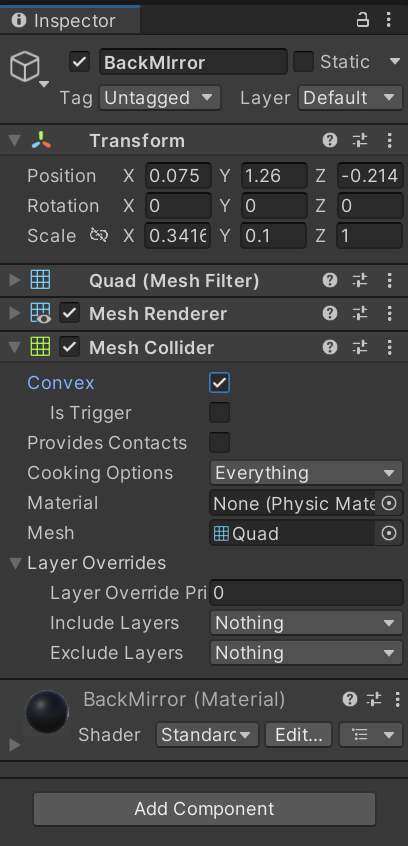

# 車両インテリアの模造

[前回の記事](./2_1.md)ではハンドルコントローラを用いて，Standard Assetsの車両を操作する方法をご説明しました．

しかし，Standard Assetsの車両はかなり簡素です．
そこで，今回は，アセットストアから取得した車両のアセットを用いて，車内インテリアをリアルにしていきます．
また，車内に後方確認が行えるバックミラーも模造します．

## この記事で説明すること
この記事では以下を説明します．
- 運転席目線のカメラを設置する方法
- アセットストアのアセットで車内インテリアをリアルにする方法
- Unityでカメラを追加する方法
- カメラの映像を左右反転させて投影する方法

## 参考サイト

> [Unity5のStandardAssetで、車を動かしてみよう](https://hajimete-program.com/blog/2016/07/06/unity5%E3%81%AEstandardasset%E3%81%A7%E3%80%81%E8%BB%8A%E3%82%92%E5%8B%95%E3%81%8B%E3%81%97%E3%81%A6%E3%81%BF%E3%82%88%E3%81%86/)

> [Unity内で3Dモデルを反転させる](https://bluebirdofoz.hatenablog.com/entry/2023/09/30/234345)

>[カメラ](https://docs.unity3d.com/ja/2018.4/Manual/class-Camera.html)

> [（Unity）バックミラーの作り方](https://mono-pro.net/archives/6092)

> [【Unity】Tagの追加ってどうやるの？【初心者向け】](https://tech.pjin.jp/blog/2018/04/10/unity_tag_create/)

## 手順
### 新規アセットの導入

[HD Low Poly Racing Car No.1201アセット](https://assetstore.unity.com/packages/3d/vehicles/land/hd-low-poly-racing-car-no-1201-118603)を使って，車内インテリアをリアルにします．

1. このアセットをアセットストアからダウンロードし，プロジェクトに取り込みます．
1. Projectウィンドウで，`Assets` > `Azerilo` > `Car Model No.1201 Asset` > `Prefab`の順に選択して，車両のモデル（以下，**Racing Carモデル**）があるディレクトリに移動します．
    

1. `Prefab`直下にあるモデルのうち，好きなものをSceneに配置します．
    

1. **Racing Carモデル**は見かけ上，自車の実体となります．Inspecterウィンドウで適切な`Scale`に設定してください．また，`Rotation`はすでに配置しているStandard Assetsの車両モデル（以下，**Standard Assetsモデル**）に合わせてください．
1. **Racing Carモデル**を**Standard Assetsモデル**と同じ位置に移動させます．

    

1. **Standard Assetsモデル**のSkyCarの直下にある各オブジェクトのInspecterウィンドウで，`Mesh Renderer`に付いているチェックを外します．
    
    

1. **Racing Carモデル**を**Standard Assetsモデル**の子オブジェクトにします．

    

1. **Racing Carモデル**の子オブジェクトであるCar_NO.1201オブジェクトを選択し，Inspecterウィンドウで，`Scale`の`X`の値を負値に変換します．これによって，左ハンドルの**Racing Carモデル**が右ハンドルに変わります．
    
    

1. **Racing Carモデル**のCar_NO.1201の子オブジェクトであるBodyMainを選択し，Inspecterウィンドウで，Mesh Coliderを削除する．

    

### カメラの視点変更

1. Hierarchyウィンドウで，Main Cameraを**Standard Assetsモデル**の子オブジェクトにします．
    
    

1. Gameビューを確認しながら，Sceneビューでカメラを移動させます．ドライバーの目の位置にカメラが設置されているようにしてください．

    
    
1. Main CameraのInspecterウィンドウのField of Viewの値を変更して運転席からの視野を調整します．

> [!NOTE]
> この時点でコントローラの位置，座席の位置，モニタの位置を固定させることをお勧めします．
> モニタに映る映像と実際の運転席からの視野が整合していないと，速度感が現実と乖離してしまったり，酔いの原因になったりします．

以上で，車両の挙動は**Standard Assetsモデル**で制御しつつ，外観や運転席からの視野を**Racing Carモデル**でリアルにすることができました．

### バックミラーの模造

1. Hierarchyウィンドウで自車のオブジェクトの子オブジェクトにQuadオブジェクトを追加します．追加したオブジェクトの名称はBackMirrorとしておきます．
    
    

2. Gameビューを確認しながら，BackMirrorオブジェクトの位置とサイズを，車両のモデルのバックミラーの位置とサイズに合わせます．
    
    

3. Projectウィンドウで適当なディレクトリに移動して，右クリックで `Create` > `Render Texture` を選択します．新たなテクスチャが作成されるので，名前をBackMirrorとしておきます．
    
    
    
4. BackMirrorテクスチャをHierarchyウィンドウ上のBackMirrorオブジェクトにドラッグ&ドロップでアタッチします．InspecterウィンドウでBackMirrorオブジェクトにBackMirrorマテリアルが追加されたことを確認できます．
    
    
    
5. Hierarchyウィンドウで自車のオブジェクトの子オブジェクトにCameraオブジェクトを新たに追加します．名前はBackMirrorCamとしておきます．
    
    
    
6. BackMirrorCamオブジェクトのInspecterウィンドウで，`Position`をBackMirrorオブジェクトと同じ値に設定してください．    
7. BackMirrorCamオブジェクトのInspecterウィンドウで`Rotation`の`Y`をMainCameraに対して反対の向きに設定してください．

    

8. BackMirrorCamオブジェクトのInspecterウィンドウでTarget Textureを`None`から`BackMirror`オブジェクトに変更してください．

    

8. BackMirrorオブジェクトのInspecterウィンドウで，Mesh Coliderの`Convex`にチェックを入れてください．
    
    
    
10. BackMirrorオブジェクトのInspecterウィンドウで，Mesh RendererのCast Shadowsを`Off`にします．これでBackMirrorオブジェクトの影が表示されなくなります．
    
    
    
11. BackMirrorオブジェクトのInspecterウィンドウで`Scale`の`X`の値を負値にしてください．

    

12. Projectウィンドウで，`Assets` > `Materials`の直下に存在するBackMirrorマテリアルを選択します．Inspecterウィンドウで，Shaderを`Standard`から`Texture[Unlit]`に変更してください．これで，光の当たり方によって，バックミラーの映像の明暗が変動することがなくなります．
    
    
    
13. Hierarchyウィンドウで自車のオブジェクトを選択します．Inspecterウィンドウで，Layerのプルダウンメニューから`Add Layer`を選択します．
    
    
    
14. `OwnCar`という新規レイヤを追加します．
15. 自車のInspecterウィンドウに戻り，Layerを新規作成した`OwnCar`レイヤに変更してください．子オブジェクトすべてに対して適用するかを尋ねられるので，`Yes`を選択してください．
    
    

17. BackMirrorCamオブジェクトのInspecterウィンドウで，Cameraコンポーネント内のCulling Maskで，`OwnCar`のチェックを外します．これで，バックミラーに自車の一部が映らなくなります．

    

17. BackMirrorオブジェクトのInspecterウィンドウでパラメータを変更して，見え方を調整します．仰角を調整する場合は，Transform内の`Rotation`の`X`の値を変更してください．画角を調整する場合は，`Field of View`の値を変更してください．

以上で，バックミラーを設定することができました．
これを応用するとサイドミラーも用意に作ることができます．
次回は複数枚のディスプレイへの映像投影を想定して，複数ウィンドウへの映像出力を行います．
