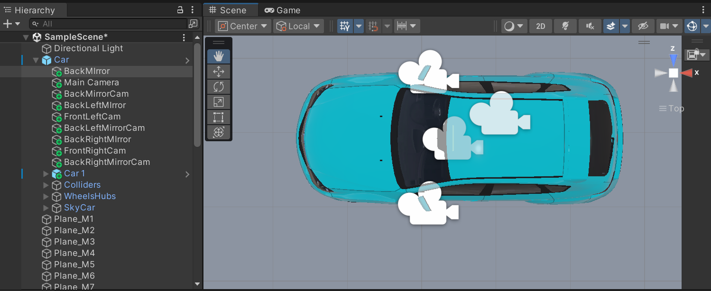
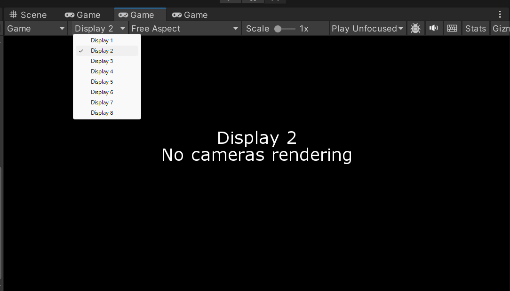
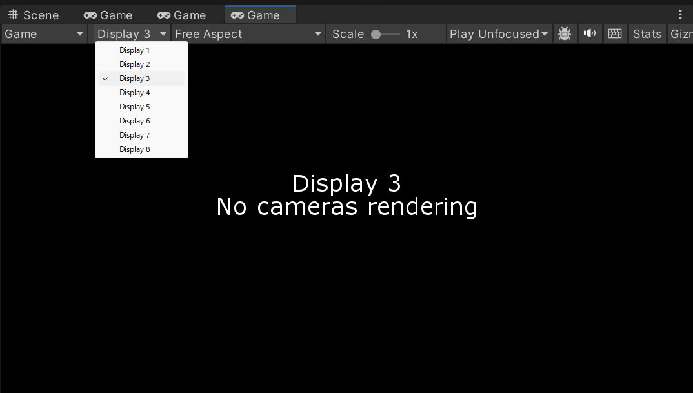
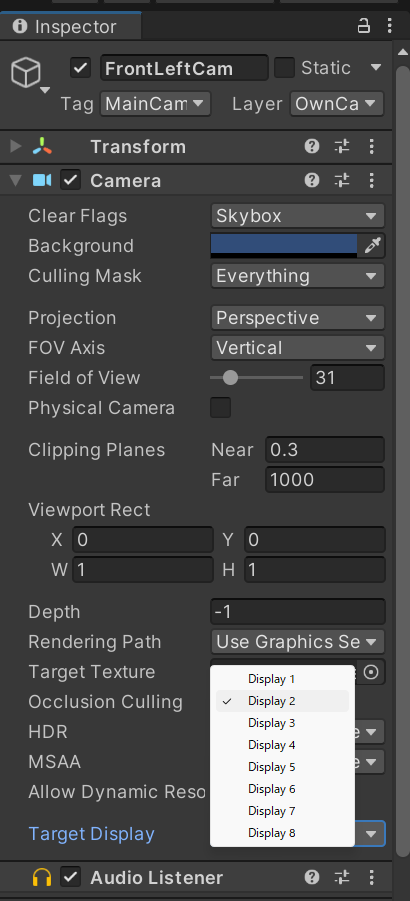
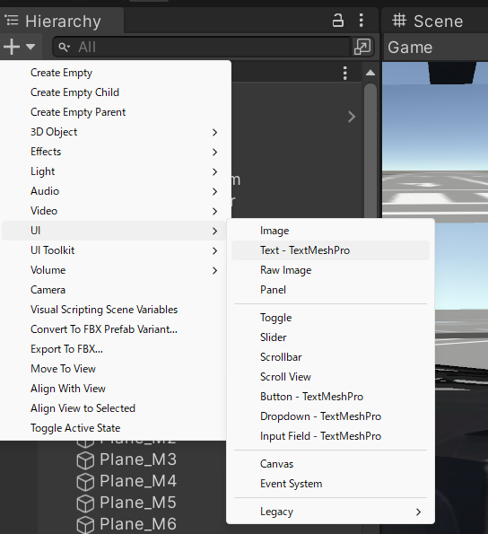
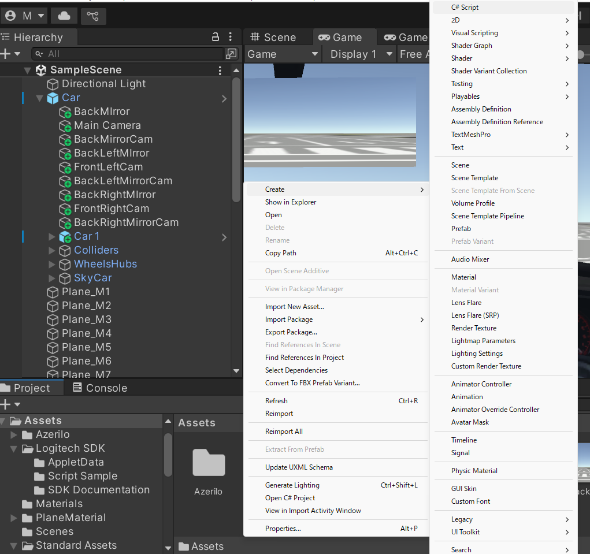
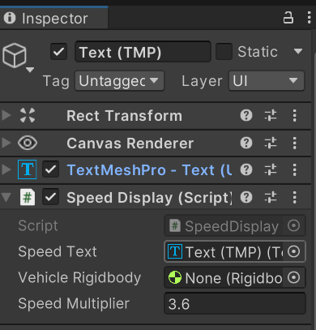
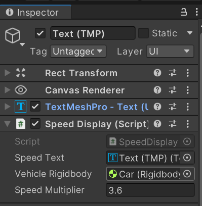
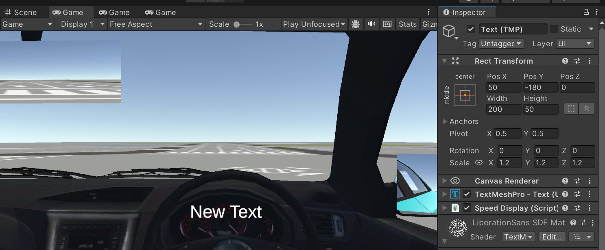

# 表示画面の設定

[前回の記事](./2_2.md))では車両インテリアを模造しました．

今回は複数画面への出力を想定して，カメラを増やし，複数ウィンドウへそれらの映像を出力する方法を説明します．
さらに，自車の走行速度を画面上に表示させるようにします．

## この記事で説明すること
この記事では以下を説明します．
- 複数のカメラの映像をそれぞれ別のウィンドウに出力する方法
- TextMeshProの使用方法
- 自車の走行速度を取得して，画面上に表示する方法

## 参考サイト

> [ゲームビュー](https://docs.unity3d.com/ja/2017.4/Manual/GameView.html)

> [【Unity】画面分割とマルチディスプレイ](https://www.urablog.xyz/entry/2017/11/26/081423)

> [【初心者向け】TextMeshProの始め方](https://shibuya24.info/entry/unity-ui-textmeshpro)

> [[Unity] 速度表示の方法 [uGUI]](https://megane-sensei.com/371/)


## 手順
### 複数ウィンドウへの映像の出力

1. まずは，前方左側を映し出すカメラ，前方右側を映し出すカメラを追加してください．また，必要に応じてサイドミラーも追加してください．具体的な方法は[前回の記事](./2_2.md)をご覧ください．

    

1. Gameビューウィンドウのタブを右クリックして， `Add Tab` > `Game` を選択します．
    
    
    
2. 増やしたGameビュータブの入力を指定します．2つ目のGameビューは`Display2`に，3つ目のGameビューは`Display3`に，映し出すような設定を行えば良いと思います．
    
    

    

    
3. カメラとディスプレイを対応付けます．左前方を映し出すカメラを選択して，InspecterウィンドウでTarget Displayを`Display2`に変更してください．同様に右前方を映し出すカメラは`Display3`にします．

    

4. 追加したGameビュータブをドラッグして，所定のディスプレイ上に移動させます．
4. 運転実験を常にエディタで行う場合には上記の設定で十分です．

### 走行速度の画面上への表示

1. Hierarchyウィンドウ上部の`+`プルダウンから`UI` > `Text - Text Mesh Pro`の順に選択します．
    
    
    
2. Projectウィンドウで適当なディレクトリに移動します．右クリックで，`Create` > `C# Script`を選択し，新規スクリプトを作成します．作成したスクリプトの名前は，`SpeedDisplay.cs`にしておきます．
    
    
    
3. Projectウィンドウで`SpeedDisplay.cs`をダブルクリックして，以下のコードを貼り付けます．
    <details>
    <summary>SpeedDisplay.cs</summary>
    ```SpeedDisplay.cs
    using UnityEngine;
    using TMPro;  // Text Mesh Proの名前空間を追加
    
    public class SpeedDisplay : MonoBehaviour
    {
        [SerializeField]
        private TextMeshProUGUI speedText;  // TextをTextMeshProUGUIに変更
    
        [SerializeField]
        private Rigidbody vehicleRigidbody;
    
        [SerializeField]
        private float speedMultiplier = 3.6f;
    
        private void Update()
        {
            if (vehicleRigidbody != null)
            {
                float speedMS = vehicleRigidbody.velocity.magnitude;
                float speedKMH = speedMS * speedMultiplier;
                speedText.text = speedKMH.ToString("F1") + " km/h";
            }
        }
    }
    ```
    </details>
    
4. `SpeedDisplay.cs`をHierarchyウィンドウのText（TMP）にドラッグ&ドロップでアタッチします．
5. HierarchyウィンドウのText（TMP）をクリックして，Inspecterウィンドウを開きます．SpeedDisplayコンポーネントのSpeed Textが`None`となっているところに，その上部のTextMeshProをドラッグ&ドロップでアタッチしてください．
    
    
    
6. Speed DisplayコンポーネントのVehicle Rigidbodyが`None`となっているところに自車のオブジェクトをドラッグ&ドロップでアタッチします．
    
    
    
7. Speed DisplayコンポーネントのSpeed Multiplierの`3.6`はm/sをkm/hに変換するための倍率なので，このまま変更しません．
7. Rect Transformコンポーネント内でテキストの表示位置やサイズは適宜調節してください．
    
    
    
8. ゲームを実行して正常に表示されるか確認してください．

今回は自車の走行速度を取得して，画面上に表示する方法についてご説明しました．
次回以降は他車を自動で走行させる制御についてご説明します．
