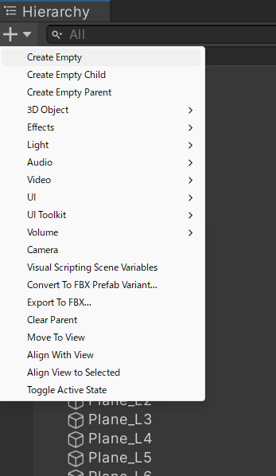
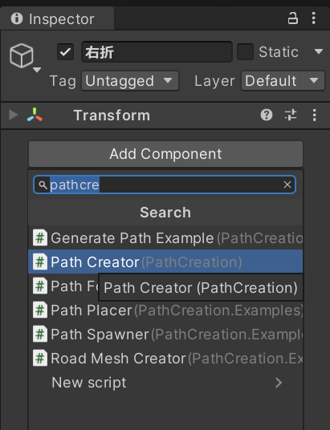
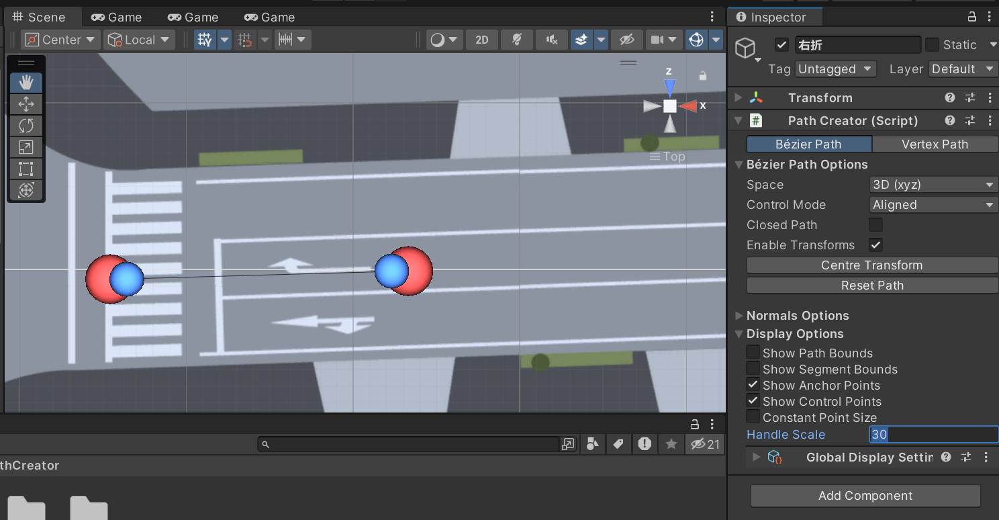
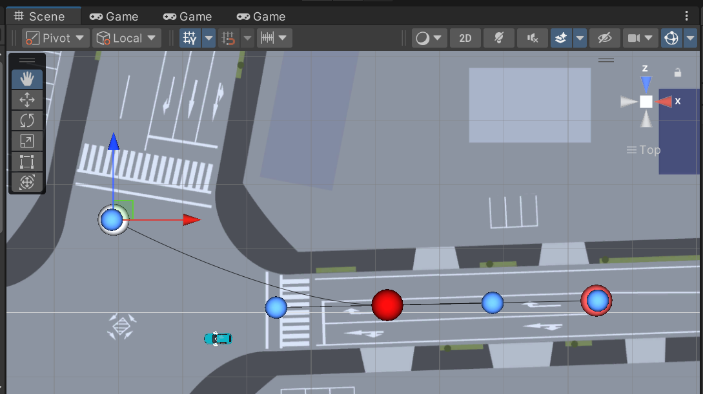
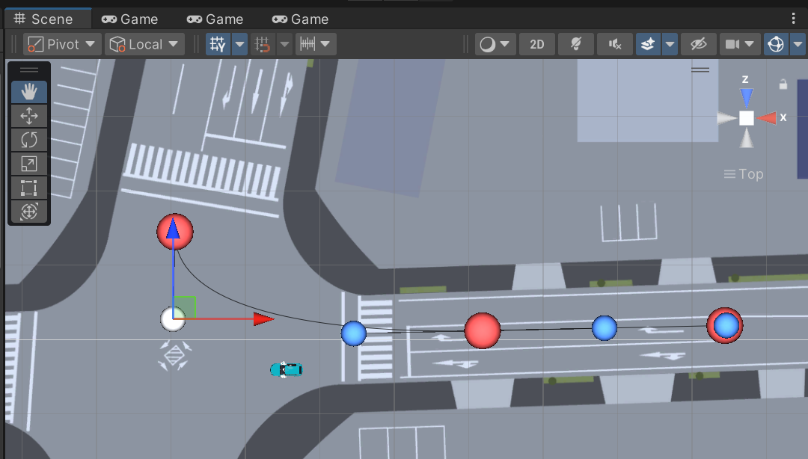
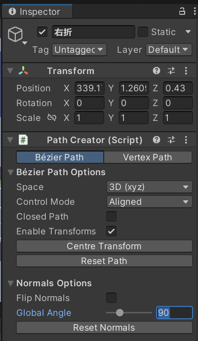
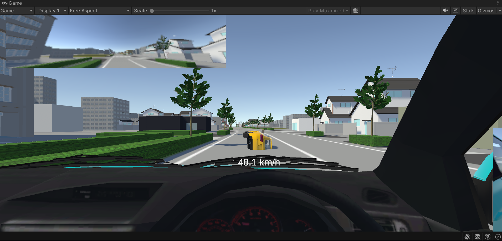
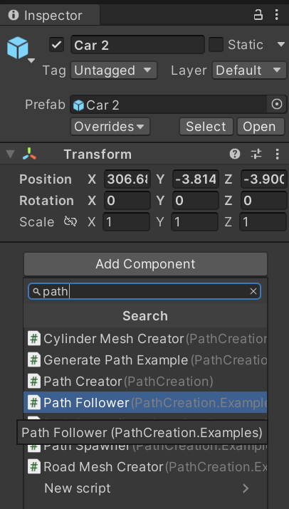
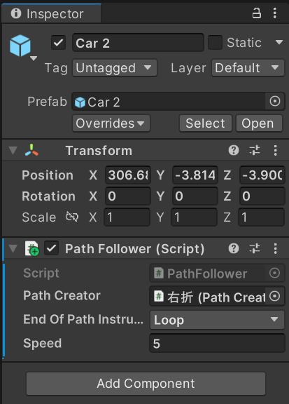

# 走行経路の作成

[前回](./2_3.md)までは，自車の運転環境を再現してきました．

今回からは他車の挙動を自動制御できるようにしていきたいと思います．
まず，今回の記事ではBézier Path Creatorアセットを用いて他車が自動走行する経路を作成しようと思います．

## この記事で説明すること
この記事では以下を説明します．
- Bézier Path Creatorアセットの使い方
- Bézier Path Creatorを用いた他車の走行経路の作成方法
- 他車を作成した経路に沿って移動させる方法

## 参考サイト

> [【新作無料アセット】無料で高機能なベジェツール！直感的で素早くパスが作れてとっても簡単♪ パスに沿って移動、オブジェクトを巡回、道路作成機能を搭載した本格ベジェパスクリエイター「Bézier Path Creator」](https://www.asset-sale.net/entry/B%C3%A9zier_Path_Creator)

## 手順

1. Bézier Path Creatorアセットを[GitHub](https://github.com/SebLague/Path-Creator)からダウンロードし，プロジェクトに取り込みます．
Path-Creator-master\Path-Creator-master\Assets直下のPathCreatorというフォルダをProjectウィンドウにドラッグ&ドロップして取り込んでください．
1. Hierarchyウィンドウの上部`+`プルダウンメニューから，`Create Empty`を選択して，空のGame Objectを作成します．名称は適当なものに変更します．

    

4. 作成した空のGame ObjectのInspectorウィンドウにおいて，`Add Component`をクリックして，PathCreaterコンポーネントを追加します．

    

5. Display OptionsコンポーネントのHandle Scaleの値を適切に設定して，アンカーポイントやハンドルを見やすいサイズに変更します．

    

5. 以下のいずれかの操作を繰り返しながら，適切な走行経路を作成していきます．
    <INS>アンカーポイントの追加</INS>
    - Sceneビュー上の任意の地点で，`Shift`キーを押しながら，左クリックすると，終点のポイントを追加できます．
    - 経路上で`Shift`キーを押しながら，左クリックすると，途中点のポイントを追加できます．

    <INS>アンカーポイントの移動</INS>
    - 移動させたいアンカーポイントを選択すると，ギズモが表示されるので，他のオブジェクト同様に，ギズモで移動させます．
    - 各アンカーポイントを選択した状態で，InspectorウィンドウのPathCreaterコンポーネントの`Position`の数値を変更しても移動させることができます．**Transformコンポーネントの数値を変更すると，経路全体に影響を与えるので，注意してください．**

        

    <INS>ハンドルの移動</INS>
    - 移動させたいハンドルを選択すると，ギズモが表示されるので，他のオブジェクト同様に，ギズモで移動させます．
    - Path CreaterコンポーネントのControl Modeがデフォルトでは，`Aligned`になっていますが，これを適当に変更することで，より柔軟にハンドル移動を行うことができるようになります．
    
        

    <INS>法線の回転</INS>
    - 各アンカーポイントのInspectorウィンドウでPath Createrコンポーネントの`Angle`の値を変更すると，局所的に経路の法線を変更する（ねじれさせる）ことができます．
    - また，PathCreaterコンポーネントの`Normal Option` > `Global Angle`の数値を変更すると，経路全体の法線の向きを変更することができます．
        

    - ゲームを実行したときに，画像のように他車の角度が想定通りでないときは，上記の設定を試してください．
        
        

5. 移動させたい他車のモデルをSceneに配置します．モデルは，たとえば，[こちらの記事](./2_2.md)で使用した[HD Low Poly Racing Car No.1201](https://assetstore.unity.com/packages/3d/vehicles/land/hd-low-poly-racing-car-no-1201-118603)などが良いと思います．

5. 新たに配置した他車のモデルのInspectorウィンドウで，`Add Component`を選択して，Path Followerコンポーネントを追加します．
    
    

5. Path Followerコンポーネント内のPath Createrが`None`となっているので，ここに先ほど作成した走行経路をドラッグ&ドロップでアタッチします．

    

5. ゲームを実行して，追加した他車が指定経路に沿って動くかどうかを確認します．
5. 確認が終わったら，Path Followerコンポーネントを削除します．

以上で他車の走行経路を作成し，その経路上を移動させることができました．
しかし，この設定では，他車はカーブで減速したり，信号で停止したりすることはありません．
また，ゲーム実行と同時に全ての車が動き出してしまうので，複数の車両を個別に動かしたい場合には，複数の経路を作るしかありません（これはかなり面倒です）．
そこで，次回以降は先行車，後続車，対向車に分けて，スクリプトを記述して，挙動を制御したいと思います．
