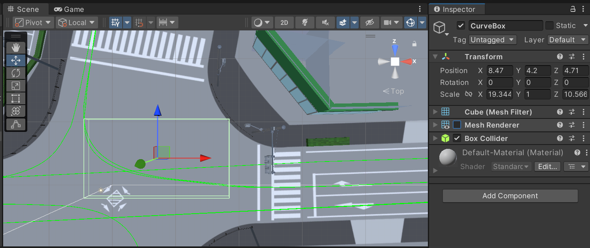

# 後続車の移動設定

[3-1の記事](./3_1.md)では他車の走行経路を作成しました．

しかし，よりリアルで自由度の高い制御を行うための改良が必要でした．
そこで今回は，他車のうち，後続車の挙動をスクリプトで制御していきたいと思います．

## この記事で説明すること
この記事では以下を説明します．
- 後続車が指定速度で指定経路上を走るような制御の設定方法
- 後続車が自車にぶつからないように追従するような制御の設定方法
- SlowZoneエリアの作成方法
- SlowZoneエリア通過時は他車が自動で減速するような設定方法

## 参考サイト

> [【Unity】Tagの追加ってどうやるの？【初心者向け】](https://tech.pjin.jp/blog/2018/04/10/unity_tag_create/)

## 手順

### プレハブの追加とスクリプトのアタッチ

1. 他車のオブジェクトをSceneに配置します．モデルは，たとえば，[2-2の記事](./2_2.md)で使用した[HD Low Poly Racing Car No.1201](https://assetstore.unity.com/packages/3d/vehicles/land/hd-low-poly-racing-car-no-1201-118603)などが良いと思います．

    
2. Hierarchyウィンドウで後続車のプレハブを選択します．Inspectorウィンドウで`Add Component`から，Rigidbodyコンポーネントを追加します．
    
3. 後続車のプレハブのInspectorウィンドウのRigidbodyコンポーネントで`Is Kinematic`にチェックを入れます．
    
    
    
4. 続いて，後続車のプレハブのInspectorウィンドウで`Add Component`から，BoxColliderコンポーネントを追加します．
        
6. Projectウィンドウで適当なディレクトリに移動します．右クリックで，`Create` > `C# Script`を選択し，新規スクリプトを作成します．作成したスクリプトの名前は，`FollowerCarController.cs`にしておきます．
7. Projectウィンドウで作成したスクリプトをダブルクリックし，以下を貼り付けます．
    <details>
    <summary>FollowerCarController.cs</summary>

    ```cs
        using UnityEngine;
        using PathCreation;

        public class FollowerCarController : MonoBehaviour
        {
            public PathCreator pathCreator;
            public EndOfPathInstruction endOfPathInstruction;
            public float normalSpeed = 30f;   // 通常速度 (km/h)
            public float reducedSpeed = 15f;  // 減速時の速度 (km/h)
            public float triggerTime = 5f;    // 発進までの待機時間（秒）

            private float currentSpeed;
            private float distanceTravelled;

            private bool isAutoDriveActive = false;
            private bool isInSlowZone = false;
            private bool isInStopZone = false;
            private GameObject stopZoneObject;
            private float elapsedTime = 0f;

            void Start()
            {
                if (pathCreator != null)
                {
                    pathCreator.pathUpdated += OnPathChanged;
                    distanceTravelled = 0f;
                    transform.position = pathCreator.path.GetPointAtDistance(distanceTravelled, endOfPathInstruction);
                    transform.rotation = pathCreator.path.GetRotationAtDistance(distanceTravelled, endOfPathInstruction);
                }

                currentSpeed = 0f; // 初期は停止
            }

            void Update()
            {
                if (pathCreator != null)
                {
                    // 発進タイミングを計測
                    if (!isAutoDriveActive)
                    {
                        elapsedTime += Time.deltaTime;
                        if (elapsedTime >= triggerTime)
                        {
                            isAutoDriveActive = true;
                            currentSpeed = normalSpeed;
                        }
                    }

                    // 自動走行が有効 & 停止ゾーンでないときのみ移動
                    if (isAutoDriveActive && !isInStopZone)
                    {
                        float speedInMetersPerSecond = currentSpeed / 3.6f;
                        distanceTravelled += speedInMetersPerSecond * Time.deltaTime;
                        transform.position = pathCreator.path.GetPointAtDistance(distanceTravelled, endOfPathInstruction);
                        transform.rotation = pathCreator.path.GetRotationAtDistance(distanceTravelled, endOfPathInstruction);
                    }
                }
            }

            void FixedUpdate()
            {
                // StopZone が非アクティブになったら再出発
                if (isInStopZone && stopZoneObject != null && !stopZoneObject.activeInHierarchy)
                {
                    isInStopZone = false;
                    stopZoneObject = null;
                    if (isAutoDriveActive)
                    {
                        currentSpeed = isInSlowZone ? reducedSpeed : normalSpeed;
                    }
                }
            }

            private void OnTriggerEnter(Collider other)
            {
                if (other.CompareTag("SlowZone") && isAutoDriveActive)
                {
                    isInSlowZone = true;
                    if (!isInStopZone)
                        currentSpeed = reducedSpeed;
                }
                else if (other.CompareTag("StopZone"))
                {
                    isInStopZone = true;
                    stopZoneObject = other.gameObject;
                    currentSpeed = 0f;
                }
            }

            private void OnTriggerExit(Collider other)
            {
                if (other.CompareTag("SlowZone") && isAutoDriveActive)
                {
                    isInSlowZone = false;
                    if (!isInStopZone)
                        currentSpeed = normalSpeed;
                }
                else if (other.CompareTag("StopZone"))
                {
                    isInStopZone = false;
                    stopZoneObject = null;
                    if (isAutoDriveActive)
                        currentSpeed = isInSlowZone ? reducedSpeed : normalSpeed;
                }
            }

            void OnPathChanged()
            {
                distanceTravelled = pathCreator.path.GetClosestDistanceAlongPath(transform.position);
            }
        }

    ```
    </details>

    <INS>スクリプトの説明</INS>
    - `normalSpeed`は，走行速度を与える変数で，Inspectorウィンドウ上で値を指定します(既定値は30)．
    - `reducedSpeed`は，カーブなどで減速する際の速度を与える変数で，Inspectorウィンドウ上で値を指定します(既定値は15)．
    - `isInSlowZone`は，SlowZoneエリアに入っているかどうかの判定結果を与える変数です．SlowZoneエリアは，同エリア内に入っている間は`reducedSpeed`で走行するという指定を行うためのものです．
    - `isInStopZone`は，StopZoneエリアに入っているかどうかの判定結果を与える変数です．StopZoneエリアは，同エリア内に入っている間は走行速度を0にするという指定を行うためのものです．
    - `triggerTime`は，後続車のプレハブの発進遅れ秒数を与える変数で，Inspectorウィンドウ上で値を指定します(既定値は5)．
    
### 各種パラメータの設定

7. `FollowerCarController.cs`をProjectウィンドウから後続車のプレハブのInspectorウィンドウにドラッグ&ドロップでアタッチします．これによってFollowerCarControllerコンポーネントが追加されます．
7. 各車でFollowerCarControllerコンポーネントの以下の項目を設定します．
    <INS>走行経路（Path Creater） </INS>
    - Path Createrが`None`となっているので，ここに[3-1の記事](./3_1.md)で作成した走行経路をドラッグ&ドロップでアタッチします．
    - 右折車であれば，右折の走行経路をアタッチするといった具合です．

    <INS>標準の走行速度（Normal Speed）</INS>
    - Normal Speedで標準の走行速度[km/h]を設定してください．

    <INS>減速ボックス走行時の走行速度（Reduced Speed）</INS>
    - Reduced Speedには，カーブなどにおける減速走行時の走行速度[km/h]を指定します．
    
    <INS>発進遅れ時間（Trigger Time）</INS>
    - Trigger Timeには，ゲーム実行から発進するまでの遅延時間[s]を設定します．

### 自車に追突しないための設定

7. 次に後続車が自車にぶつからないようにするための設定を追加します．Hierarchyウィンドウ上部の`+`プルダウンメニューから`3D Object` > `Cube`の順に選択します．
    
    

7. 追加したCubeオブジェクトは自車と後続車の車間維持のために使用するので，GapMaintainBoxのような適当な名称を設定しておきます．
7. 新たに追加したGapMaintainBoxオブジェクトのInspectorウィンドウで，`Add Component`から，Box Colliderコンポーネントを追加します．
7. Box ColliderコンポーネントのIs Triggerにチェックを入れます．
    
    

7. GapMaintainBoxオブジェクトのInspectorウィンドウで，Tagが`Untagged`になっている部分のプルダウンメニューから，`Add Tag`を選択します．

    

7. Inspectorウィンドウ上にTags & Layers メニューが開くので，`+`マークをクリックして，New Tag Name に`StopZone`と入力します．

    

7. 再びGapMaintainBoxオブジェクトのInspectorウィンドウを開き，Tagが`Untagged`になっている部分のプルダウンメニューから，`StopZone`を選択します．

    

7. GapMaintainBoxオブジェクトを自車の子オブジェクトにして，自車の後方に配置して，適当なサイズに調整します．以上の設定で，後続車が，StopZoneタグを有するGapMaintainBoxオブジェクトに接触すると，速度が0になり，追突を回避することができます．
    
    

7. さいごに，GapMaintainBoxオブジェクトのInspectorウィンドウで，Mesh Rendererのチェックを外し，オブジェクトを透明化させます．
    
    

7. ゲームを実行して，後続車のプレハブが想定通りに動くかどうか確認します．


### カーブで減速させる設定

> [!NOTE]
> 以降の内容は[前回の記事](./3_2.md)の最終節と同じです．すでに実装済みの方は飛ばしてください．


カーブ走行時などに，先ほど設定したReduced Speedで走行するような設定を追加します．
1. Hierarchyウィンドウ上部の`+`プルダウンメニューから`3D Object` > `Cube`の順に選択します．
    
    

2. 追加したCubeオブジェクトがSlowZoneエリアになります．CurveBoxのような適当な名称を設定しておきます．
7. 新たに追加したCurveBoxオブジェクトのInspectorウィンドウで，`Add Component`から，Box Colliderコンポーネントを追加します．
7. Box ColliderコンポーネントのIs Triggerにチェックを入れます．

    

7. CurveBoxオブジェクトのInspectorウィンドウで，Tagが`Untagged`になっている部分のプルダウンメニューから，`Add Tag`を選択します．

    

7. Inspectorウィンドウ上にTags & Layers メニューが開くので，`+`マークをクリックして，New Tag Name に`SlowZone`と入力します．

    

7. 再びCurveBoxオブジェクトのInspectorウィンドウを開き，Tagが`Untagged`になっている部分のプルダウンメニューから，`SlowZone`を選択します．

    

7. CurveBoxオブジェクトを，他車を減速させたい位置(たとえば，交差点内部)に配置して，適当なサイズに調整します．以上の設定で，他車が，SlowZoneタグを有するCurveBoxオブジェクトに接触すると，速度がReducedSpeedになります．

    

7. さいごに，CurveBoxオブジェクトのInspectorウィンドウで，Mesh Rendererのチェックを外し，オブジェクトを透明化させます．

    

10. ゲームを実行して，他車が指定エリアできちんと減速するかどうかを確認します．


今回は後続車の挙動を制御する設定を実装しました．
次回は対向車の挙動を制御する設定を実装したいと思います．
