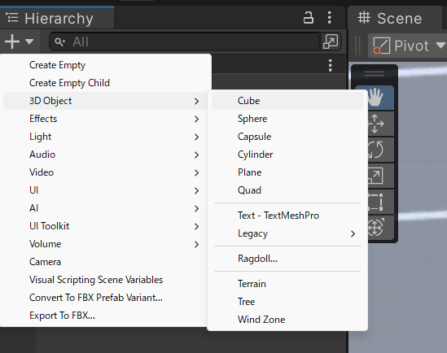
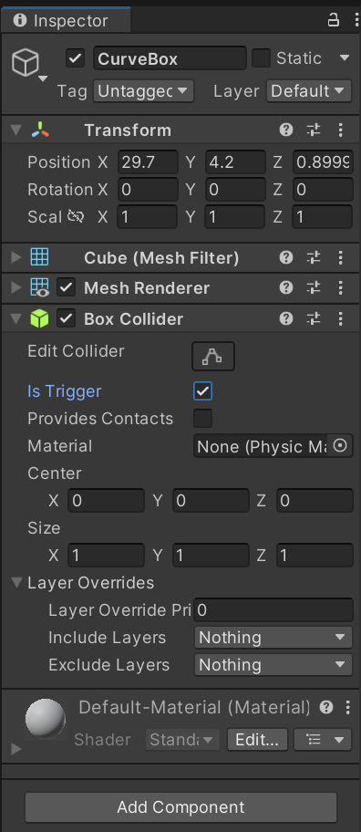
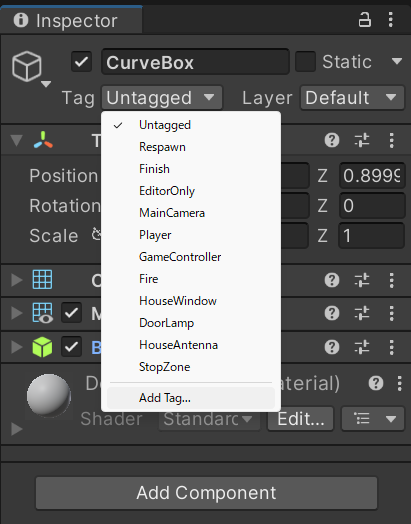
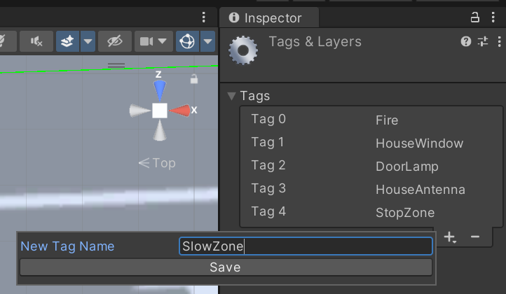
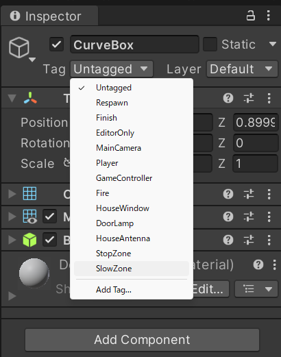
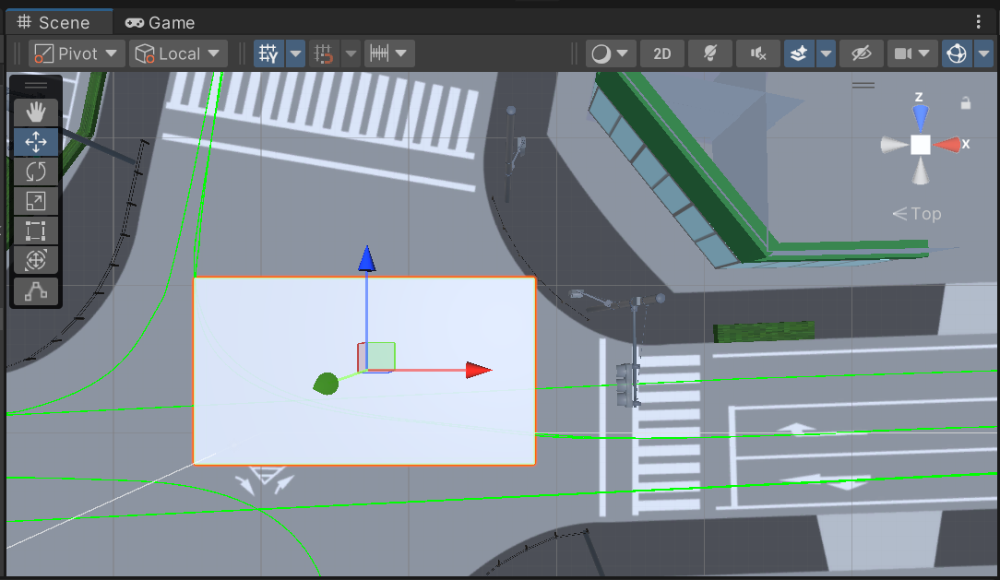
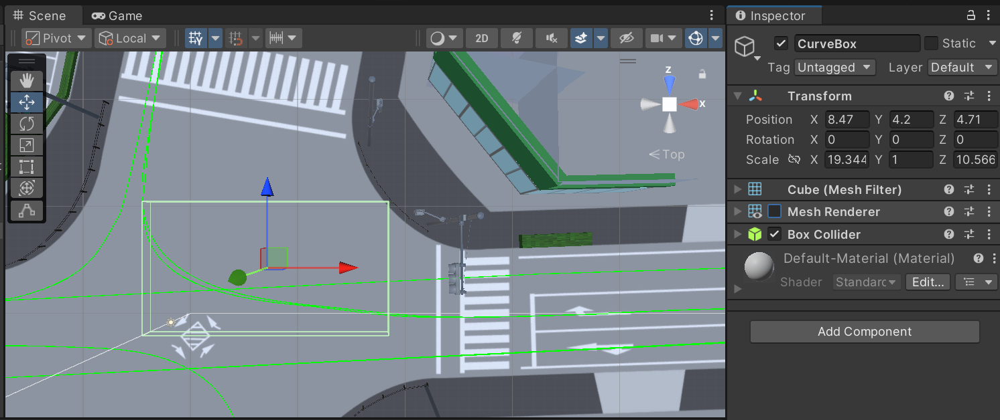

# 対向車の移動設定

[3-1の記事](./3_1.md)では他車の走行経路を作成しました．

しかし，よりリアルで自由度の高い制御を行うための改良が必要でした．
そこで今回は，他車のうち，対向車の挙動をスクリプトで制御していきたいと思います．

## この記事で説明すること
この記事では以下を説明します．
- 対向車が指定速度で指定経路上を走るような制御の設定方法
- 対向車が自車が指定距離まで近づいたときに動き出すような制御の設定方法
- SlowZoneエリアの作成方法
- SlowZoneエリア通過時は他車が自動で減速するような設定方法

## 参考サイト

> [【Unity】Tagの追加ってどうやるの？【初心者向け】](https://tech.pjin.jp/blog/2018/04/10/unity_tag_create/)

## 手順

### プレハブの追加とスクリプトのアタッチ

1. 他車のオブジェクトをSceneに配置します．モデルは，たとえば，[2-2の記事](./2_2.md)で使用した[HD Low Poly Racing Car No.1201](https://assetstore.unity.com/packages/3d/vehicles/land/hd-low-poly-racing-car-no-1201-118603)などが良いと思います．

2. Hierarchyウィンドウで対向車のプレハブを選択します．Inspectorウィンドウで`Add Component`から，Rigidbodyコンポーネントを追加します．
    
3. 対向車のプレハブのInspectorウィンドウのRigidbodyコンポーネントで`Is Kinematic`にチェックを入れます．
    
   
    
4. 続いて，対向車のプレハブのInspectorウィンドウで`Add Component`から，BoxColliderコンポーネントを追加します．
    
6. Projectウィンドウで適当なディレクトリに移動します．右クリックで，`Create` > `C# Script`を選択し，新規スクリプトを作成します．作成したスクリプトの名前は，`OncomingCarController.cs`にしておきます．
7. Projectウィンドウで作成したスクリプトをダブルクリックし，以下を貼り付けます．
    <details>
    <summary>OncomingCarController.cs</summary>

    ```cs
    using UnityEngine;
    using PathCreation;
    
    public class OncomingCarController : MonoBehaviour
    {
        public PathCreator pathCreator;
        public EndOfPathInstruction endOfPathInstruction;
        public float normalSpeed = 50f;  // 通常速度 (km/h)
        public float reducedSpeed = 30f;  // 減速時の速度 (km/h)
        public float triggerDistance = 200f; // 自動運転を開始する距離 (m)
        public Transform targetCar; // 他のプレイヤーの車を指定するTransform
    
        private float currentSpeed;
        private float distanceTravelled;
    
        private bool isAutoDriveActive = false;
        private bool isInSlowZone = false;
        private bool isInStopZone = false;
    
        private GameObject stopZoneObject;
    
        public float CurrentSpeed
        {
            get => currentSpeed;
            set => currentSpeed = value;
        }
    
        void Start()
        {
            if (pathCreator != null)
            {
                pathCreator.pathUpdated += OnPathChanged;
    
                distanceTravelled = 0f;
                transform.position = pathCreator.path.GetPointAtDistance(distanceTravelled, endOfPathInstruction);
                transform.rotation = pathCreator.path.GetRotationAtDistance(distanceTravelled, endOfPathInstruction);
            }
    
            currentSpeed = 0f;
        }
    
        void Update()
        {
            if (pathCreator != null)
            {
                if (targetCar != null && !isAutoDriveActive)
                {
                    float distanceToTarget = Vector3.Distance(transform.position, targetCar.position);
    
                    if (distanceToTarget <= triggerDistance)
                    {
                        isAutoDriveActive = true;
                        currentSpeed = normalSpeed;
                    }
                }
    
                if (isAutoDriveActive && !isInStopZone)
                {
                    float speedInMetersPerSecond = currentSpeed / 3.6f;
                    distanceTravelled += speedInMetersPerSecond * Time.deltaTime;
                    transform.position = pathCreator.path.GetPointAtDistance(distanceTravelled, endOfPathInstruction);
                    transform.rotation = pathCreator.path.GetRotationAtDistance(distanceTravelled, endOfPathInstruction);
                }
            }
        }
    
        private void FixedUpdate()
        {
            if (isInStopZone && stopZoneObject != null && !stopZoneObject.activeInHierarchy)
            {
                isInStopZone = false;
                currentSpeed = isInSlowZone ? reducedSpeed : normalSpeed;
            }
        }
    
        private void OnTriggerEnter(Collider other)
        {
            if (other.CompareTag("SlowZone") && isAutoDriveActive)
            {
                isInSlowZone = true;
                currentSpeed = reducedSpeed;
            }
            else if (other.CompareTag("StopZone"))
            {
                isInStopZone = true;
                stopZoneObject = other.gameObject;
                currentSpeed = 0f;
            }
        }
    
        private void OnTriggerExit(Collider other)
        {
            if (other.CompareTag("SlowZone") && isAutoDriveActive)
            {
                isInSlowZone = false;
                if (!isInStopZone)
                {
                    currentSpeed = normalSpeed;
                }
            }
            else if (other.CompareTag("StopZone"))
            {
                isInStopZone = false;
                stopZoneObject = null;
                if (isAutoDriveActive)
                {
                    currentSpeed = isInSlowZone ? reducedSpeed : normalSpeed;
                }
            }
        }
    
        void OnPathChanged()
        {
            distanceTravelled = pathCreator.path.GetClosestDistanceAlongPath(transform.position);
        }
    }
    ```
    </details>

    <INS>スクリプトの説明</INS>
    - `normalSpeed`は，走行速度を与える変数で，Inspectorウィンドウ上で値を指定します(既定値は50)．
    - `reducedSpeed`は，カーブなどで減速する際の速度を与える変数で，Inspectorウィンドウ上で値を指定します(既定値は30)．
    - `triggerDistance`は，対向車のプレハブの発進タイミングを指定する変数で，Inspectorウィンドウ上で値を指定します(既定値は200)．指定のオブジェクトが対向車のプレハブまで`triggerDistance`以下まで近づいたときに，対向車のプレハブが発進するようなスクリプトとなっています．
    - `isInSlowZone`は，SlowZoneエリアに入っているかどうかの判定結果を与える変数です．SlowZoneエリアは，同エリア内に入っている間は`reducedSpeed`で走行するという指定を行うためのものです．
    - `isInStopZone`は，StopZoneエリアに入っているかどうかの判定結果を与える変数です．StopZoneエリアは，同エリア内に入っている間は走行速度を0にするという指定を行うためのものです．
    
### 各種パラメータの設定

7. `OncomingCarController.cs`をProjectウィンドウから対向車のプレハブのInspectorウィンドウにドラッグ&ドロップでアタッチします．これによってOncomingCarControllerコンポーネントが追加されます．
7. 各車でOncomingCarControllerコンポーネントの以下の項目を設定します．
    <INS>走行経路（Path Creater）</INS>
    - Path Createrが`None`となっているので，ここに[3-1の記事](./3_1.md)で作成した走行経路をドラッグ&ドロップでアタッチします．
    - 右折車であれば，右折の走行経路をアタッチするといった具合です．

    <INS>標準の走行速度（Normal Speed）</INS>
    - Normal Speedで標準の走行速度[km/h]を設定します．

    <INS>減速時の走行速度（Reduced Speed）</INS>
    - Reduced Speedには，カーブなどにおける減速走行時の走行速度[km/h]を指定します．
    
    <INS>距離計測のターゲット車両（Target Car）</INS>
    - ここで指定したオブジェクトと対向車のプレハブとの距離を計測し，その距離が次の<INS>動き出す距離[m]</INS>以下になったとき，対向車のプレハブが発進するような設定を，上記スクリプトで施しています．
    - 任意のオブジェクトをドラッグ&ドロップでアタッチします．
    - 自車のオブジェクトを指定しておくのが，無難だと思います．
    
    <INS>動き出す距離（Trigger Distance）</INS>
    - <INS>距離計測のターゲット車両</INS>と対向車のプレハブの間の距離がここで設定する距離[m]以下となったときに，対向車のプレハブが発進します．
    
7. ゲームを実行して，対向車のプレハブが想定通りに動くかどうか確認します．

### カーブで減速させる設定

> [!NOTE]
> 以降の内容は[前回の記事](./3_2.md)の最終節と同じです．すでに実装済みの方は飛ばしてください．


カーブ走行時などに，先ほど設定したReduced Speedで走行するような設定を追加します．
1. Hierarchyウィンドウ上部の`+`プルダウンメニューから`3D Object` > `Cube`の順に選択します．
    
    

2. 追加したCubeオブジェクトがSlowZoneエリアになります．CurveBoxのような適当な名称を設定しておきます．
7. 新たに追加したCurveBoxオブジェクトのInspectorウィンドウで，`Add Component`から，Box Colliderコンポーネントを追加します．
7. Box ColliderコンポーネントのIs Triggerにチェックを入れます．

    

7. CurveBoxオブジェクトのInspectorウィンドウで，Tagが`Untagged`になっている部分のプルダウンメニューから，`Add Tag`を選択します．

    

7. Inspectorウィンドウ上にTags & Layers メニューが開くので，`+`マークをクリックして，New Tag Name に`SlowZone`と入力します．

    

7. 再びCurveBoxオブジェクトのInspectorウィンドウを開き，Tagが`Untagged`になっている部分のプルダウンメニューから，`SlowZone`を選択します．

    

7. CurveBoxオブジェクトを，他車を減速させたい位置(たとえば，交差点内部)に配置して，適当なサイズに調整します．以上の設定で，他車が，SlowZoneタグを有するCurveBoxオブジェクトに接触すると，速度がReducedSpeedになります．

    

7. さいごに，CurveBoxオブジェクトのInspectorウィンドウで，Mesh Rendererのチェックを外し，オブジェクトを透明化させます．

    

10. ゲームを実行して，他車が指定エリアできちんと減速するかどうかを確認します．

今回は対向車の挙動を制御する設定を実装しました．
次回は信号制御の設定を実装したいと思います．
