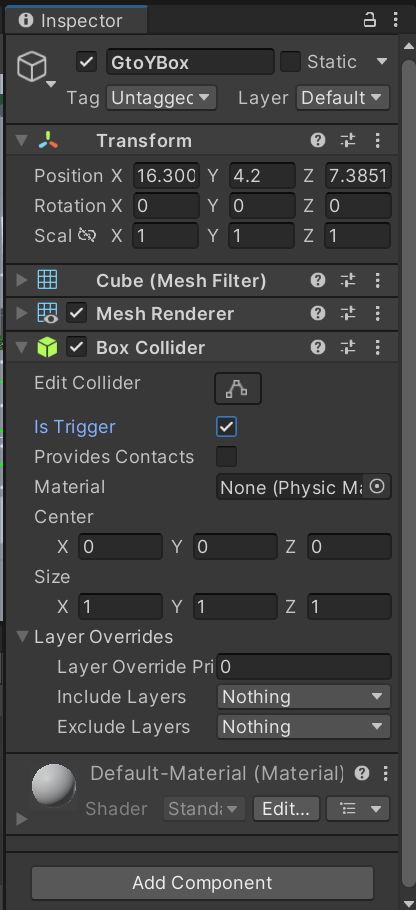
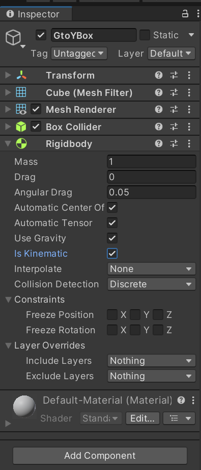
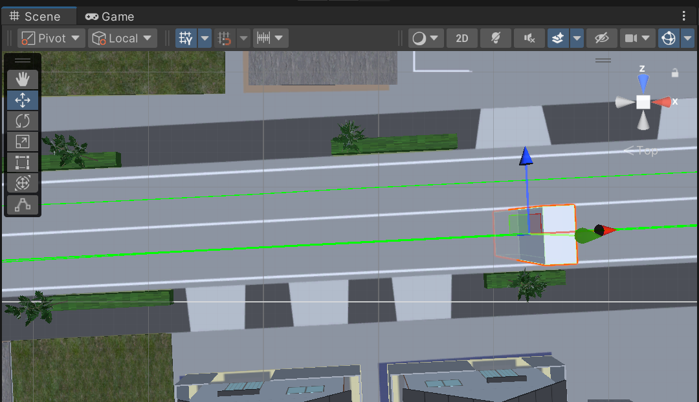
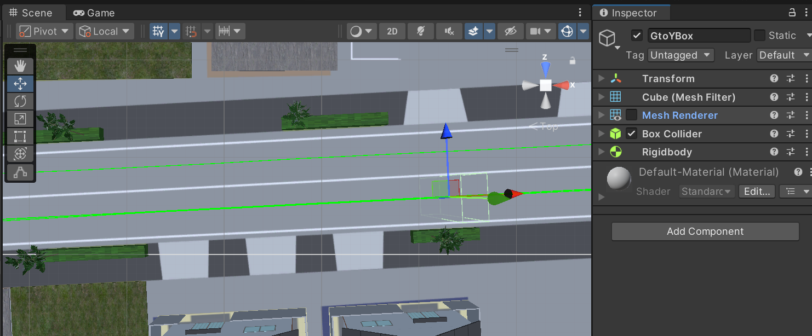
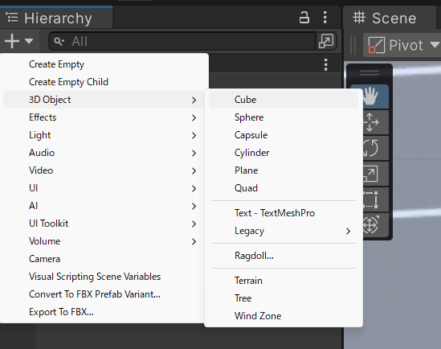
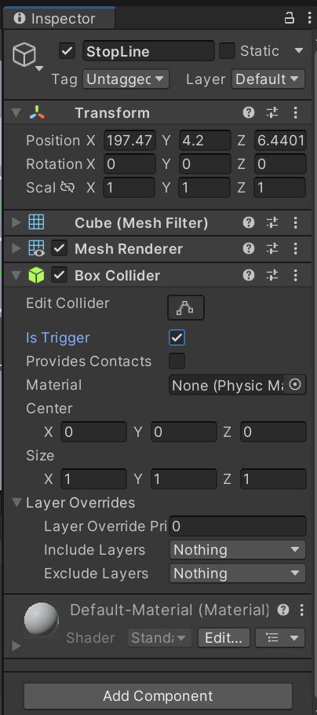
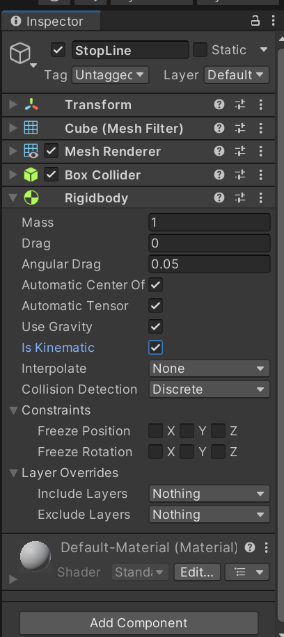
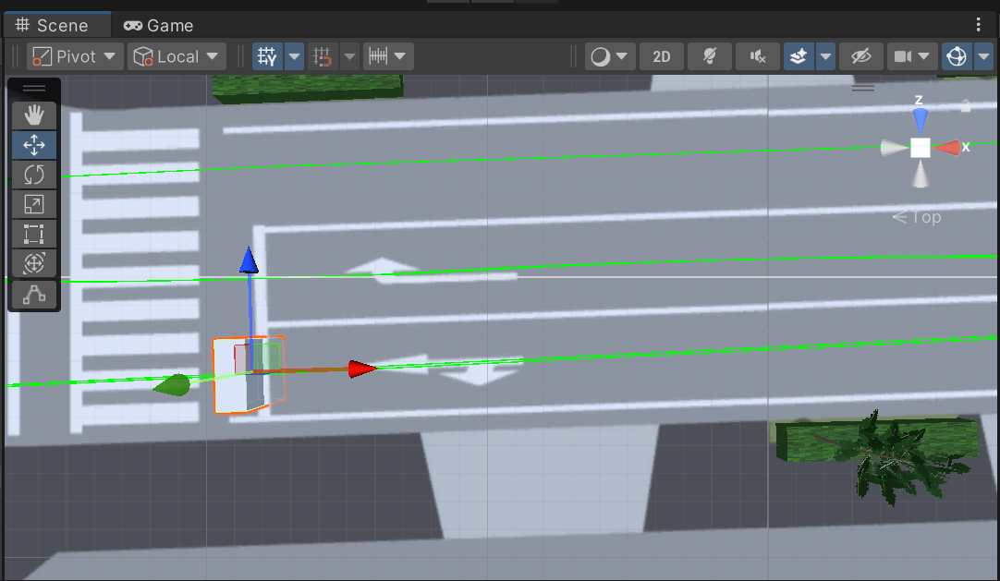
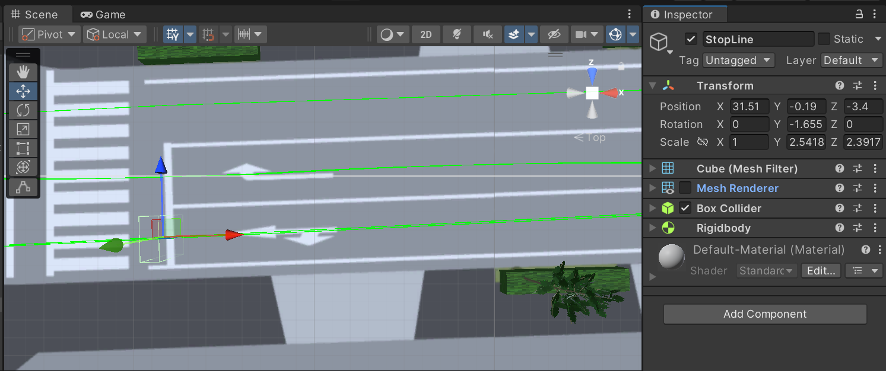

# 信号現示の制御

[前回](./3_4.md)までは他車の自動走行に関する設定を追加しました．

今回は，[1-3の記事](./1_3.md)で導入した信号機のモデルを任意現示設定で点灯・消灯させます．
さらに，その現示に合わせて，他車が停止したり，発進したりする設定を実装します．

## この記事で説明すること
この記事では以下を説明します．
- 任意の現示設定に合わせて信号機を点灯・消灯させる方法
- 他車を赤信号で停止，青信号で発進させる方法

## 参考サイト

> [【Unity入門】SetActiveで表示切り替え!よくある疑問も徹底解消!](https://www.sejuku.net/blog/53536)

## 手順
### 信号機の店頭・消灯を制御する
1. まず，現示変化のきっかけとなるトリガーを有するオブジェクトを用意します．Hierarchyウィンドウ上部の`+`プルダウンから`3D Object` > `Cube`の順に選択します．
    
    

7. 追加したCubeオブジェクトは，現示を青から黄色に変化させるきっかけに使用するので，GtoYBoxのような適当な名称を設定しておきます．

7. 新たに追加したGtoYBoxオブジェクトのInspecterウィンドウで，`Add Component`から，Box Coliderコンポーネントを追加します．

7. Box ColiderコンポーネントのIs Triggerにチェックを入れます．
    
    

2. さらに，`Add Component`から，Rigidbodyコンポーネントを追加します．
2. そして，Rigidbodyコンポーネントの`Is Kinematic`にチェックを入れます．
    
    

7. GtoYBoxを交差点前の適当な位置に配置し，サイズに調整します．

    

8. RtoYBoxオブジェクトのInspecterウィンドウで，Mesh Rendererのチェックを外し，オブジェクトを透明化させます．

    

6. Projectウィンドウで適当なディレクトリに移動します．右クリックで，`Create` > `C# Script`を選択し，新規スクリプトを作成します．作成したスクリプトの名前は，`SignalIndicationController.cs`にしておきます．
7. Projectウィンドウで作成したスクリプトをダブルクリックし，以下を貼り付けます．
    <details>
    <summary>SignalIndicationController.cs</summary>

    ```SignalIndicationController.cs
    using UnityEngine;
    using System.Collections;
    
    public class SignalIndicationController : MonoBehaviour
    {
        public GameObject targetVehicle; // トリガー対象の車両
    
        // 表示するオブジェクトとその表示時間
        public GameObject objectToShow;
        public float objectToShowDuration = 3f;
    
        public GameObject secondObject1;
        public GameObject secondObject2;
        public float secondObjectDuration = 9f;
    
        public GameObject thirdObject;
        public float thirdObjectDuration = 3f;
    
        public GameObject fourthObject;
        public float fourthObjectDuration = 80f;
    
        public GameObject finalObject; // 常に表示
    
        // トリガー通過時に即座に非表示にするオブジェクト
        public GameObject objectToHide;
    
        private void Start()
        {
            // 初期状態でオブジェクトを非表示
            if (objectToShow != null) objectToShow.SetActive(false);
            if (secondObject1 != null) secondObject1.SetActive(false);
            if (secondObject2 != null) secondObject2.SetActive(false);
            if (thirdObject != null) thirdObject.SetActive(false);
            if (fourthObject != null) fourthObject.SetActive(false);
    
            // `finalObject` は初期状態から表示する
            if (finalObject != null) finalObject.SetActive(true);
    
            // 初期状態で非表示にする対象オブジェクトは表示状態のまま
            if (objectToHide != null) objectToHide.SetActive(true);
        }
    
        private void OnTriggerEnter(Collider other)
        {
            if (other.gameObject == targetVehicle)
            {
                // すぐに非表示にするオブジェクト
                if (objectToHide != null)
                {
                    objectToHide.SetActive(false);
                }
    
                // 順番にオブジェクトを表示
                StartCoroutine(ShowSequence());
            }
        }
    
        private IEnumerator ShowSequence()
        {
            yield return StartCoroutine(ShowAndHide(objectToShow, objectToShowDuration));
            
            // `secondObject1` と `secondObject2` を同時に表示
            yield return StartCoroutine(ShowAndHideTwoObjects(secondObject1, secondObject2, secondObjectDuration));
            
            yield return StartCoroutine(ShowAndHide(thirdObject, thirdObjectDuration));
            yield return StartCoroutine(ShowAndHide(fourthObject, fourthObjectDuration));
            // 最後のオブジェクトはずっと表示させておく
            yield return StartCoroutine(ShowAndHide(finalObject, 1000));
        }
    
        private IEnumerator ShowAndHide(GameObject obj, float duration)
        {
            if (obj != null)
            {
                obj.SetActive(true);
                yield return new WaitForSeconds(duration);
                obj.SetActive(false);
            }
        }
    
        private IEnumerator ShowAndHideTwoObjects(GameObject obj1, GameObject obj2, float duration)
        {
            if (obj1 != null) obj1.SetActive(true);
            if (obj2 != null) obj2.SetActive(true);
    
            yield return new WaitForSeconds(duration);
    
            if (obj1 != null) obj1.SetActive(false);
            if (obj2 != null) obj2.SetActive(false);
        }
    }
    ```
    </details>

    <INS>スクリプトの説明</INS>
    - `targetVehicle`は，現示変化のきっかけを与えるオブジェクトです．`targetVehicle`がGtoYBoxを通過すると，現示が変化し始めます．
    - `objectToShow`は，最初に表示（点灯）させるオブジェクトです．黄色現示点灯用のオブジェクトを割り当てる想定です．
    - `objectToShowDuration`は，`objectToShow`を表示（点灯）させる時間で，Inspecterウィンドウ上で値を指定します(既定値は3)．
    - `secondObject1`と`secondObject2`は，2番目に表示（点灯）させるオブジェクトです．右折専用現示点灯用のオブジェクトを割り当てる想定です．
    - `secondObjectDuration`は，`secondObject1`と`secondObject2`を表示（点灯）させる時間で，Inspecterウィンドウ上で値を指定します(既定値は9)．
    - `thirdObject`は，3番目に表示（点灯）させるオブジェクトです．黄色現示点灯用のオブジェクトを割り当てる想定です．
    - `thirdObjectDuration`は，`thirdObject`を表示（点灯）させる時間で，Inspecterウィンドウ上で値を指定します(既定値は3)．
    - `fourthObject`は，4番目に表示（点灯）させるオブジェクトです．赤現示点灯用のオブジェクトを割り当てる想定です．
    - `fourthObjectDuration`は，`fourthObject`を表示（点灯）させる時間で，Inspecterウィンドウ上で値を指定します(既定値は80)．．
    - `finalObject`は，最後に表示（点灯）させるオブジェクトです．青現示点灯用のオブジェクトを割り当てる想定です．
    - `objectToHide`は，`objectToShow`の表示（点灯）と同時に，非表示（消灯）させるオブジェクトです．青現示点灯用のオブジェクトを割り当てる想定です．

11. `SignalIndicationController.cs`をProjectウィンドウからGtoYBoxのInspecterウィンドウにドラッグ&ドロップでアタッチします．これによってSignal Indication Controllerコンポーネントが追加されます．

12. Signal Indication Controllerコンポーネントの以下の項目を設定します．
    <INS>現示変化のトリガー車両（Target Vehicle）</INS>
    - ここで指定したオブジェクトがGtoYBoxを通過すると，現示が変化し始めます．
    - Target Vehicleが`None`となっているので，任意のオブジェクトをドラッグ&ドロップでアタッチします．
    - 自車のオブジェクトを指定しておくのが，無難だと思います．
    
    <INS>最初に表示させるオブジェクト（Object To Show）</INS>
    - Target VehicleがGtoYBoxを通過したときに，表示（点灯）するオブジェクトです．
    - Object To Showが`None`になっているので，[1-3の記事](./1_3.md)で導入した信号機モデルの子オブジェクトである，V_signal_yellowオブジェクトをドラッグ&ドロップでアタッチします．

    <INS>最初に表示させるオブジェクトの表示時間（Object To Show Duration）</INS>
    - Object To Showの表示（点灯）時間[s]を設定します．
    - Object To Show Durationが`3`（既定値）になっているので，変更したい場合は，任意の表示（点灯）時間[s]を設定します．

    <INS>2番目に表示させるオブジェクト（Second Object 1, Second Object 2）</INS>
    - Object To Showの非表示（消灯）と同時に，表示（点灯）するオブジェクトです．
    - Second Object 1が`None`になっているので，[1-3の記事](./1_3.md)で導入した信号機モデルの子オブジェクトである，V_signal_redオブジェクトをドラッグ&ドロップでアタッチします．
    - Second Object 2が`None`になっているので，[1-3の記事](./1_3.md)で導入した信号機モデルの子オブジェクトである，V_signal_rightオブジェクトをドラッグ&ドロップでアタッチします．

    <INS>2番目に表示させるオブジェクトの表示時間（Second Object Duration）</INS>
    - Second Object 1, Second Object 2の表示（点灯）時間[s]を設定します．
    - Second Object Durationが`9`（既定値）になっているので，変更したい場合は，任意の表示（点灯）時間[s]を設定します．

    <INS>3番目に表示させるオブジェクト（Third Object）</INS>
    - Second Object 1, Second Object 2の非表示（消灯）と同時に，表示（点灯）するオブジェクトです．
    - Third Objectが`None`になっているので，[1-3の記事](./1_3.md)で導入した信号機モデルの子オブジェクトである，V_signal_yellowオブジェクトをドラッグ&ドロップでアタッチします．

    <INS>3番目に表示させるオブジェクトの表示時間（Third Object Duration）</INS>
    - Third Objectの表示（点灯）時間[s]を設定します．
    - Third Object Durationが`3`（既定値）になっているので，変更したい場合は，任意の表示（点灯）時間[s]を設定します．

    <INS>4番目に表示させるオブジェクト（Forth Object）</INS>
    - Third Objectの非表示（消灯）と同時に，表示（点灯）するオブジェクトです．
    - Forth Objectが`None`になっているので，[1-3の記事](./1_3.md)で導入した信号機モデルの子オブジェクトである，V_signal_redオブジェクトをドラッグ&ドロップでアタッチします．

    <INS>4番目に表示させるオブジェクトの表示時間（Forth Object Duration）</INS>
    - Forth Objectの表示（点灯）時間[s]を設定します．
    - Forth Object Durationが`80`（既定値）になっているので，変更したい場合は，任意の表示（点灯）時間[s]を設定します．

    <INS>最後に表示させるオブジェクト（Final Object）</INS>
    - Forth Objectの非表示（消灯）と同時に，表示（点灯）するオブジェクトです．
    - Final Objectが`None`になっているので，[1-3の記事](./1_3.md)で導入した信号機モデルの子オブジェクトである，V_signal_blueオブジェクトをドラッグ&ドロップでアタッチします．

    <INS>最初に非表示にするオブジェクト（Object To Hide）</INS>
    - Object To Showの表示（点灯）と同時に，非表示（消灯）するオブジェクトです．
    - Object To Hideが`None`になっているので，[1-3の記事](./1_3.md)で導入した信号機モデルの子オブジェクトである，V_signal_blueオブジェクトをドラッグ&ドロップでアタッチします．

13. 以上で現示変化の設定が完了しました．実際にゲームを実行して，Target VehicleがGtoYBoxを通過して以降，指定した秒数で現示が変化するか観察・確認してみてください．

## この記事で説明すること

1. まず，他車を停止させるためのオブジェクトを用意します．Hierarchyウィンドウ上部の`+`プルダウンから`3D Object` > `Cube`の順に選択します．
    
    

7. 追加したCubeオブジェクトは，現示を青から黄色に変化させるきっかけに使用するので，StopLineのような適当な名称を設定しておきます．

7. 新たに追加したStopLineオブジェクトのInspecterウィンドウで，`Add Component`から，Box Coliderコンポーネントを追加します．

7. Box ColiderコンポーネントのIs Triggerにチェックを入れます．

    

2. さらに，`Add Component`から，Rigidbodyコンポーネントを追加します．
2. そして，Rigidbodyコンポーネントの`Is Kinematic`にチェックを入れます．

    

7. StopLineオブジェクトにStopZoneタグを付与します．INspecterウィンドウでTagが`Untagged`になっている箇所をクリックして，[3-3の記事](./3_3.md)で作成したStopZoneタグに変更してください．

7. StopLineを交差点前の停止線の位置に配置し，サイズに調整します．

    

8. StopLineオブジェクトのInspecterウィンドウで，Mesh Rendererのチェックを外し，オブジェクトを透明化させます．

    

6. Projectウィンドウで適当なディレクトリに移動します．右クリックで，`Create` > `C# Script`を選択し，新規スクリプトを作成します．作成したスクリプトの名前は，`StopLineController.cs`にしておきます．
7. Projectウィンドウで作成したスクリプトをダブルクリックし，以下を貼り付けます．
    <details>
    <summary>StopLineController.cs</summary>

    ```SignalIndicationController.cs
    using UnityEngine;
    using System.Collections;
    
    public class StopLineController : MonoBehaviour
    {
        public GameObject targetVehicle; // トリガー対象の車両
    
        // 出現するオブジェクト
        public GameObject showObject1;
        public GameObject showObject2;
        public float AppearanceDelay = 3f; // トリガー後に出現するまでの時間（デフォルト3秒）
        public float Duration = 92f; // 表示時間
    
        private void Start()
        {
            // 初期状態ではすべてのオブジェクトを非表示
            if (showObject1 != null) showObject1.SetActive(false);
            if (showObject2 != null) showObject2.SetActive(false);
        }
    
        private void OnTriggerEnter(Collider other)
        {
            if (other.gameObject == targetVehicle)
            {
                StartCoroutine(TriggerSequence());
            }
        }
    
        private IEnumerator TriggerSequence()
        {
            // 2つのオブジェクトを指定秒後に出現させ、一定時間後に非表示
            yield return new WaitForSeconds(AppearanceDelay);
            yield return StartCoroutine(ShowAndHideTwoObjects(showObject1, showObject2, Duration));
    
        }
    
        private IEnumerator ShowAndHideTwoObjects(GameObject obj1, GameObject obj2, float duration)
        {
            if (obj1 != null) obj1.SetActive(true);
            if (obj2 != null) obj2.SetActive(true);
    
            yield return new WaitForSeconds(duration);
    
            if (obj1 != null) obj1.SetActive(false);
            if (obj2 != null) obj2.SetActive(false);
        }
    }
    ```
    </details>

    <INS>スクリプトの説明</INS>
    - `targetVehicle`は，Stop Lineオブジェクト出現のきっかけを与えるオブジェクトです．`targetVehicle`がGtoYBoxを通過し，指定秒数が経過するとStopLineが出現するように設定します．
    - `showObject1`, `showObject2`は，GtoYBoxを`targetVehicle`が通過して以後，指定秒数で表示（出現）するオブジェクトです．StopLineオブジェクトを割り当てる想定です．
    - `AppearanceDelay`は，Target VehicleのGtoYBox通過後，`showObject1`, `showObject2`が現れるまでの時間で，Inspecterウィンドウ上で値を指定します(既定値は3)．
    - `Duration`は，`showObject1`と`showObject2`を表示（出現）させる時間で，Inspecterウィンドウ上で値を指定します(既定値は92)．
    
11. `StopLineController.cs`をProjectウィンドウからGtoYBoxのInspecterウィンドウにドラッグ&ドロップでアタッチします．これによってStop Line Controllerコンポーネントが追加されます．
    
12. Stop Line Controllerコンポーネントの以下の項目を設定します．
    <INS>StopLine出現のトリガー車両（Target Vehicle）</INS>
    - ここで指定したオブジェクトがGtoYBoxを通過すると，現示が変化し始めます．
    - Target Vehicleが`None`となっているので，SignalIndicationController.csの設定のTarget Vehicleと同一のオブジェクトをドラッグ&ドロップでアタッチします．
    
    <INS>表示させるオブジェクト（Show Object 1, Show Object 2）</INS>
    - Target VehicleがGtoYBoxを通過してから指定秒数後に，表示（出現）するオブジェクトです．
    - Show Object 1が`None`になっているので，StopLineオブジェクトをドラッグ&ドロップでアタッチします．
    - Show Object 2にもうひとつオブジェクトを設定することができます．対向車線の停止線の位置にStopZoneタグを付与したオブジェクトを設置し，Show Object 2にアタッチすると，対向車線を走行する車両も信号現示に合わせて停止させることができるようになります．

    <INS>表示させるオブジェクトの表示遅れ時間（Appearance Delay）</INS>
    - Target VehicleのGtoYBox通過後，`showObject1`, `showObject2`が現れるまでの時間[s]を設定します．
    - Appearance Delayが`3`（既定値）になっているので，変更したい場合は，任意の表示（点灯）時間[s]を設定します．
    - ここで設定する値は信号現示に合わせた値とします．すなわち，たとえば，直進車線の停止線位置に設置したStopLineの表示遅れ時間は，黄色現示の点灯時間となります．

    <INS>表示させるオブジェクトの表示時間（Duration）</INS>
    - Show Object 1, Show Object 2の表示（出現）時間[s]を設定します．
    - Durationが`92`（既定値）になっているので，変更したい場合は，任意の表示（点灯）時間[s]を設定します．
    - ここで設定する値は信号現示に合わせた値とします．すなわち，たとえば，直進車線の停止線位置に設置したStopLineの表示時間は，右折専用現示，（専用現示消灯後の）黄色現示，赤現示の点灯時間の和です．
 
13. 以上で，最大2車線分の走行車両について，信号現示に合わせて停止・発進させる設定を追加しました．GtoYBoxに，さらにStop Line Controllerコンポーネントを追加し，StopLineを増設，適切なAppearance DelayとDurationを設定することで，さらに多くの車線についても同様の制御を行うことができます．

今回までで，他車を任意の設定で走行させることができるようになりました．
これまでの記事が，ドライビングシミュレータの活用事例の増加につながると嬉しいです．
