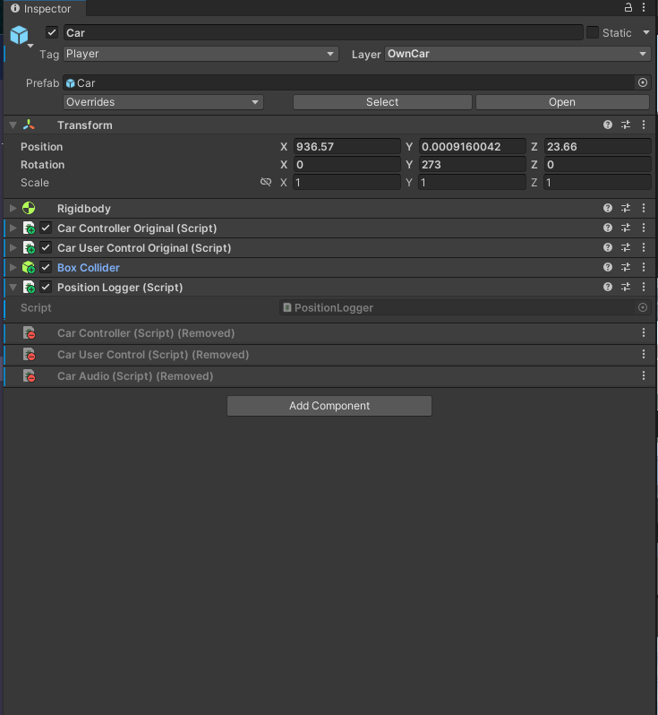
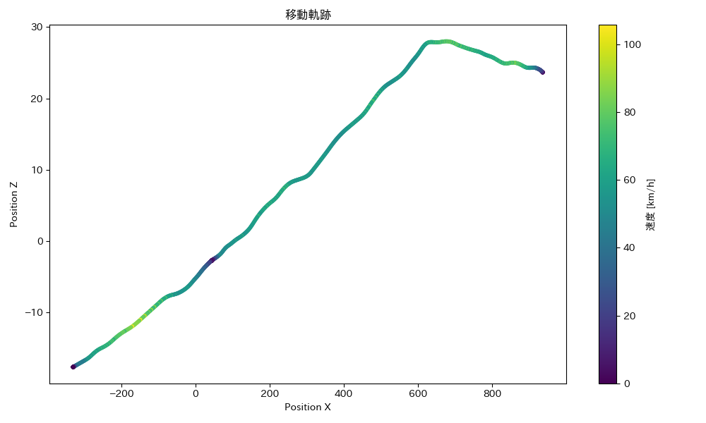
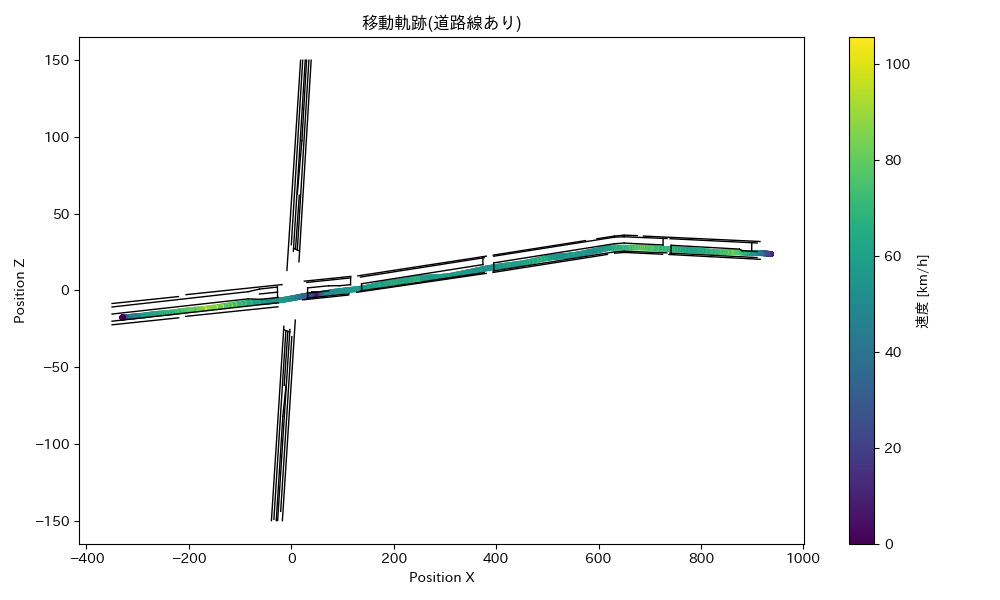

# 車両の移動軌跡の取得

[前回](./3_5.md)まででドライビングシミュレータを構築することができました．

今回は，仮想空間内を走行する車両の軌跡を取得したいと思います．

## この記事で説明すること
この記事では以下を説明します．
- オブジェクトの座標を指定した時間間隔で取得する方法
- 取得した指定時間間隔ごとのオブジェクトの座標から，速度を計算する方法
- 各時点のオブジェクトの座標を散布図としてプロットし，移動軌跡を可視化する方法

## 参考サイト

> [動くCubeの座標値をCSVファイルに出力したい](https://teratail.com/questions/219547)

> [Unity内で取得したデータをcsvに書き出す方法](https://qiita.com/TeRa_YUKI/items/16adb50fa3426afda6f5)

## 手順
### オブジェクトの座標値を指定秒数間隔で取得する
1. Projectウィンドウで適当なディレクトリに移動します．右クリックで，`Create` > `C# Script`を選択し，新規スクリプトを作成します．作成したスクリプトの名前は，`PositionLogger.cs`にしておきます．

2. Projectウィンドウで作成したスクリプトをダブルクリックし，以下を貼り付けます．
    <details>
    <summary>PositionLogger.cs</summary>

    ```cs
        using System;
        using System.IO;
        using UnityEngine;

        public class PositionLogger : MonoBehaviour
        {
            private string filePath;

            void Start()
            {
                filePath = Application.dataPath + "/GetTrajectory_own/PositionLog.csv";

                File.WriteAllText(filePath, "time,Position_x,Position_y,Position_z\n");

                InvokeRepeating("LogPosition", 0f, 0.1f);
            }

            void LogPosition()
            {
                Vector3 pos = transform.position;

                string logLine = string.Format(
                    "{0:F3},{1:F5},{2:F5},{3:F5}",
                    Time.time, pos.x, pos.y, pos.z
                );

                File.AppendAllText(filePath, logLine + "\n");
            }
        }

    ```
    </details>

    <INS>スクリプトの説明</INS>
    - `filePath = Application.dataPath + "/GetTrajectory_own/PositionLog.csv"`は，取得した座標値を書き込むcsvファイルを指定しています．ここでは，Assetsフォルダの直下の`GetTrajectory_own`というフォルダにある`PositionLog.csv`に書き込むという想定です．
    - `InvokeRepeating("LogPosition", 0f, 0.1f);`で座標を取得する時間間隔を指定しています．今回は0.1秒間隔で取得することにしており，この`0.1`を任意の数値に変更することができます．

3. `PositionLogger.cs`をProjectウィンドウから軌跡を取得したいオブジェクトのInspectorウィンドウにドラッグ&ドロップでアタッチします．これによってPositionLoggerコンポーネントが追加されます．ここでは，自車の移動軌跡を取得するという想定です．

    

4. 続いて，取得した座標値を書き込むファイルを用意します．上記のスクリプト内の`filePath = ~~`に合わせて，適宜変更してください．ここでは，Assetsフォルダ直下にGetTrajectory_ownフォルダを作成し，さらに，その下にPositionLogという名前のcsvファイルを作成してください．この操作は，Finderやエクスプローラーといったソフトを利用するのが良いと思います．

5. ここまでの設定が完了したら，ゲームを実行して自車の座標値が，およそ0.1秒ごとに記録されているか確認します．
   
### 取得した座標値を可視化する
Pythonで取得した移動軌跡を可視化したいと思います．
以下のコードを適当な環境で実行します．

```python

# import library
import pandas as pd
import matplotlib.pyplot as plt
import japanize_matplotlib

# import PositionLog data
df = pd.read_csv("PositionLog.csv", encoding='shift_jis')
print(df)

# calculate velocity
df['Delta_time'] = df['time'].diff()
df['Delta_Position_x'] = df['Position_x'].diff()
df['Delta_Position_z'] = df['Position_z'].diff()
df['distance'] = (df['Delta_Position_x'].pow(2) + df['Delta_Position_z'].pow(2)).pow(0.5)
df['velocity_kmh'] = df['distance'] / df['Delta_time'] * 3.6
print(df)

# Show scatter plot
plt.figure(figsize=(10, 6))
scatter = plt.scatter(df['Position_x'], df['Position_z'], c=df['velocity_kmh'], cmap='viridis', s=10)
cbar = plt.colorbar(scatter)
cbar.set_label('速度 [km/h]')
plt.xlabel('Position X')
plt.ylabel('Position Z')
plt.title('位置Xと位置Zの散布図（速度に応じた色分け）')
plt.grid(False)
plt.tight_layout()
plt.show()

```
上記のコードを回すと以下のように各時点における座標値が速度とともにプロットされ，移動軌跡を見ることができます．
また，下記画像のような移動軌跡を得る座標データは本リポジトリのPython_Scriptsフォルダ内で公開しています．



しかし，上記の図では，道路のどのあたり(路肩付近，中央線付近等)を走っているか等がよくわかりません．
そこで，道路縁の線や車線境界線も併せてプロットしたいと思います．
Unityで道路縁の線や車線境界線の端点のX座標とZ座標を調べて，csvファイルに記録します．

> [!IMPORTANT]
> UnityではY軸が鉛直方向軸です．

記録した座標の一例は本リポジトリのPython_Scriptsフォルダ内で公開しています．
なお，本リポジトリで紹介する構築方法では，道路縁の線や車線境界線は画像として貼り付けており，それらの端部の座標をUnityから出力することはできません．そのため，航空写真から計測を行う要領で，各点の座標値を取得します．
先ほどのPythonコードの散布図描画部分を以下に差し替えて，再び適切な環境で実行します．
```Py

# import RoadLine data
road_df = pd.read_csv("RoadLine.csv")
print(road_df)

# Show scatter plot
plt.figure(figsize=(10, 6))
scatter = plt.scatter(df['Position_x'], df['Position_z'], c=df['velocity_kmh'], cmap='viridis', s=10, label='位置データ')
for _, row in road_df.iterrows():
    x_coords = [row['Point1_x'], row['Point2_x']]
    z_coords = [row['Point1_z'], row['Point2_z']]  # "z" is actually the y-axis
    plt.plot(x_coords, z_coords, color='black', linewidth=1)
cbar = plt.colorbar(scatter)
cbar.set_label('速度 [km/h]')
plt.xlabel('Position X')
plt.ylabel('Position Z')
plt.title('位置Xと位置Zの散布図と道路ライン（速度に応じた色分け）')
plt.grid(False)
# plt.xlim(100,300)  # optionally
# plt.ylim(-50, 70)  # optionally
plt.tight_layout()
plt.show()

```

以下のように道路縁の線や車線境界線とともに，移動軌跡を描画することができました．

