# 沿道路外施設への入庫
本記事では，[3-1の記事](./3_1.md)，[3-2の記事](./3_2.md)，[3-5の記事](./3_5.md)の応用として，沿道に立地する路外施設へ入庫する他車の再現を行いたいと思います．

## この記事で説明すること
この記事では以下を説明します．
- 沿道に立地する路外施設へ右折入庫する他車とその移動経路の再現方法
- その右折入庫車両に対向車とぶつからずに入庫させる方法

## 手順
1. まずは，右折入庫車の移動経路を[3-1の記事](3_1.md)と同様の方法で作成します．

    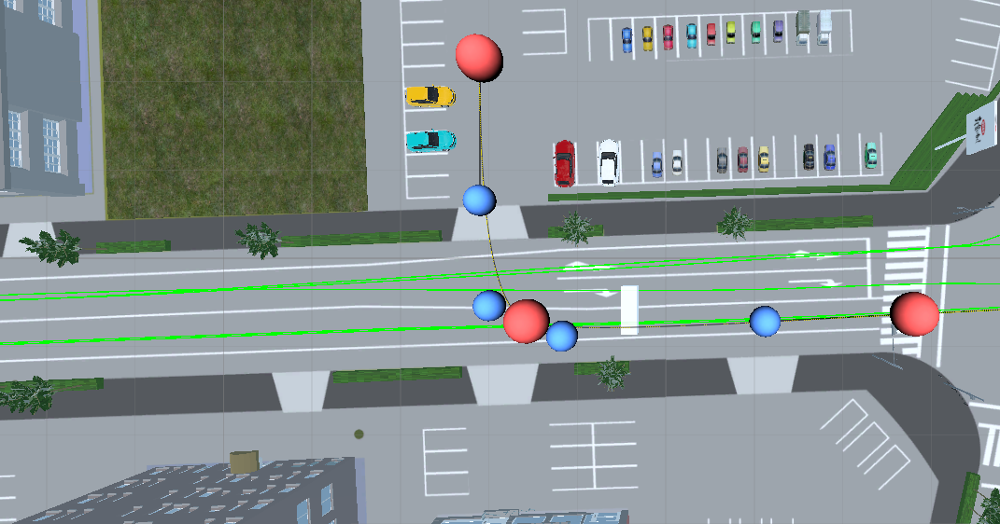

2. [3-2の記事](./3_2.md)と同様の方法で右折入庫車のプレハブを配置し，その移動経路として，作成した右折入庫用の移動経路をアタッチします．

    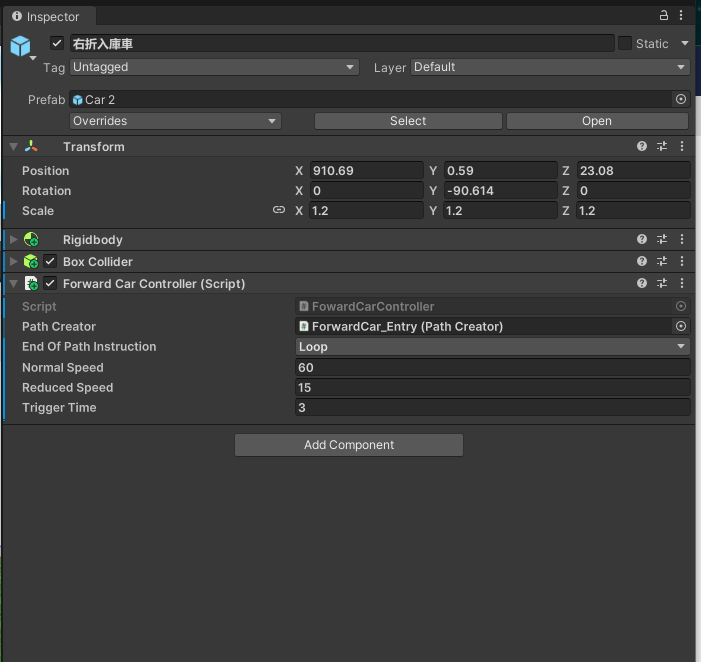

3. 入庫前に一時停止するような設定を，[3-5の記事](./3_5.md)の方法を応用して実装します．まずは，入庫前の一時停止をさせたい位置に，新たなオブジェクトを設置します．

    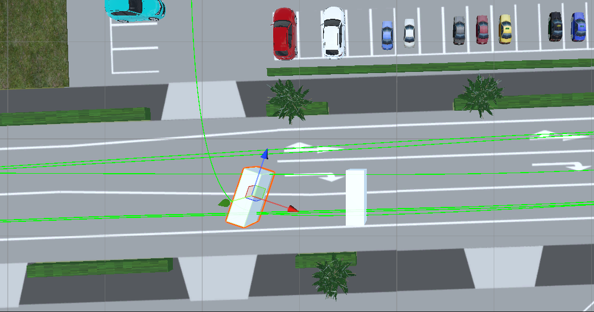

4. つぎに，追加したオブジェクトのタグに，StopZoneタグを設定します．また，トリガー機能を有効にしておきます．

    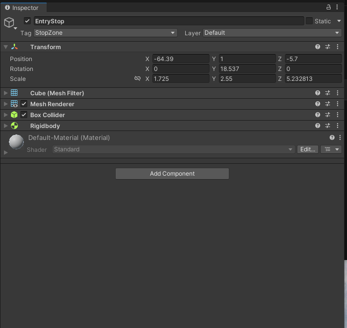

5. 入庫前の一時停止挙動が自然になるように，一時停止前に減速が行われるようにします．これは[3-2の記事](./3_2.md)で実装したカーブで減速させる設定と同様に行います．まずは，一時停止位置の直前(減速させたい位置)に，新たなオブジェクトを追加します．

    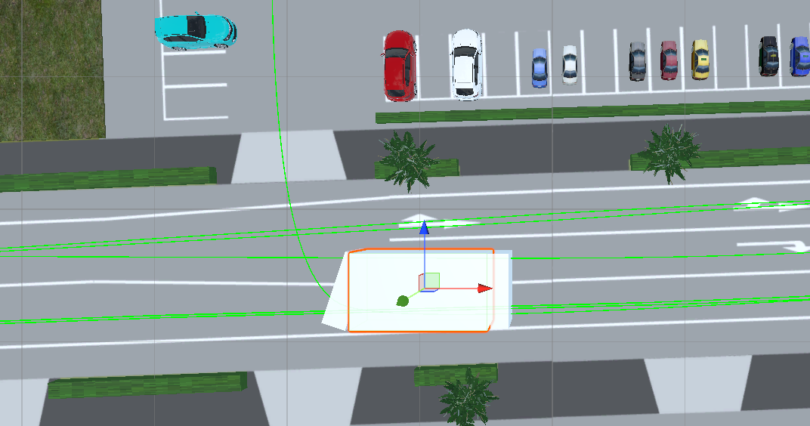

6. つぎに，追加したオブジェクトのタグに，SlowZoneタグを設定します．また，トリガー機能を有効にしておきます．

    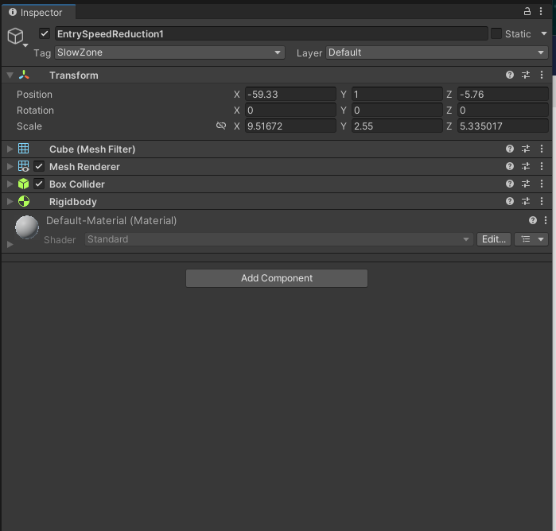

7. 入庫時に減速が行われるようにします．これは[3-2の記事](./3_2.md)で実装したカーブで減速させる設定と同様に行います．まずは，一時停止位置の直前(減速させたい位置)に，新たなオブジェクトを追加します．

    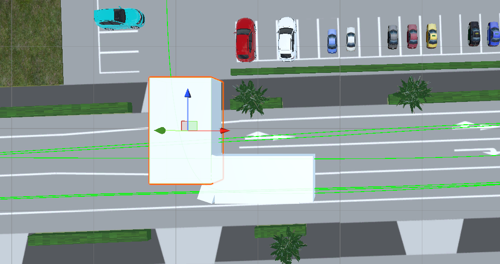

8. つぎに，追加したオブジェクトのタグに，SlowZoneタグを設定します．また，トリガー機能を有効にしておきます．

    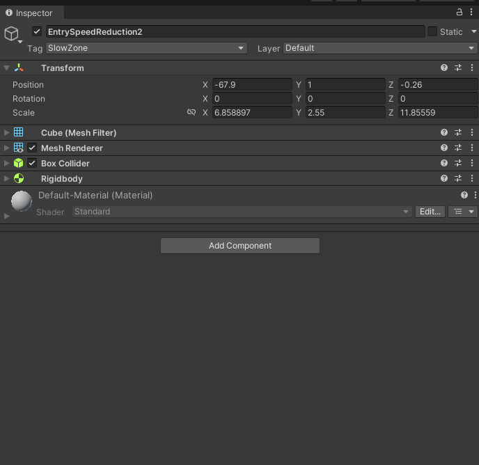
    
9. ここまでで設定した入庫車を停止または減速させるためのオブジェクトを任意のタイミングで出現または消滅させるために，[3-5の記事](./3_5.md)で実装した設定を応用します．まずは，その出現と消滅のトリガーとなるオブジェクトを追加して，適切に配置します．

    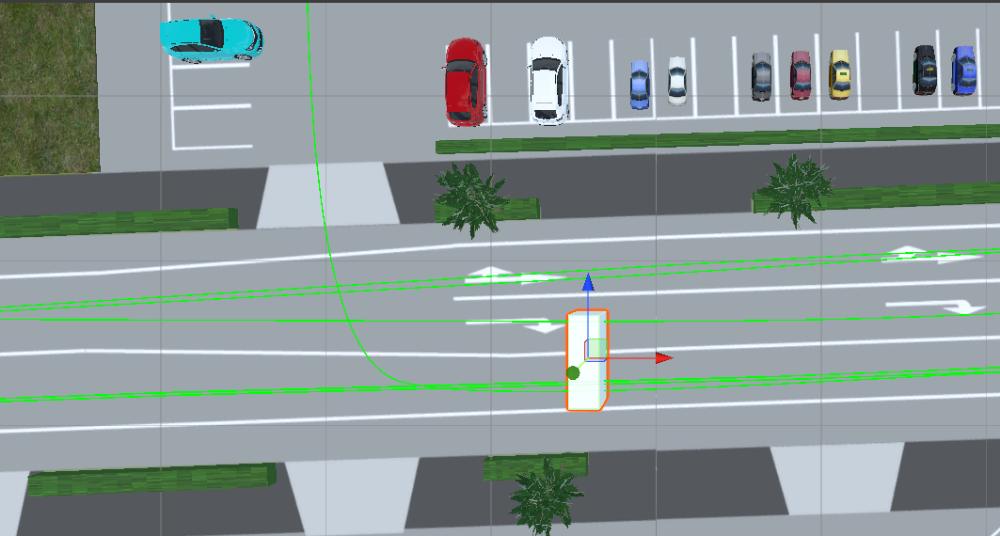

10. つぎに，追加したオブジェクトでトリガー機能を有効にし，[3-5の記事](./3_5.md)で用意したStopLineController.csを2回アタッチして，StopLineControllerコンポーネントを2つ作成します．

    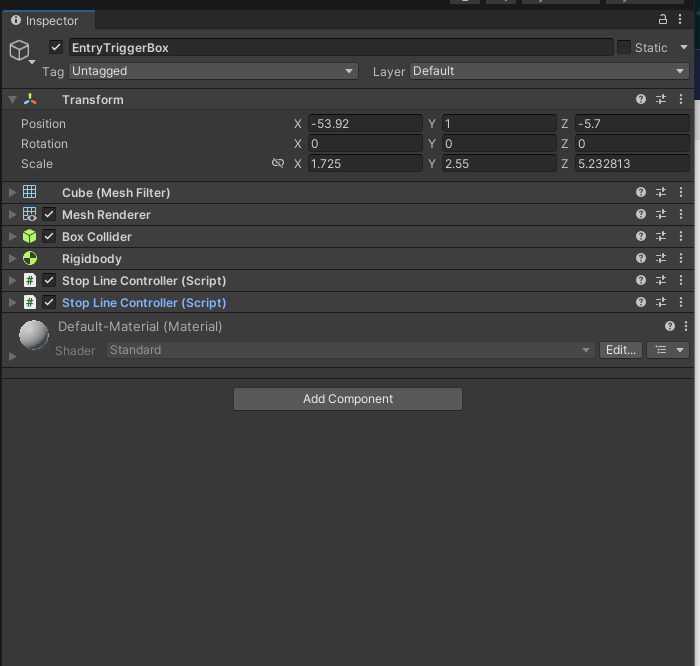

11. [3-5の記事](./3_5.md)と同様に，StopLineControllerコンポーネントの設定を変更します．下記画像では，右折入庫車が通過して以降，20秒間入庫車を一時停止させるオブジェクトが出現し(入庫車が一時停止し)，そのあと10秒間入庫時に減速させるオブジェクトが出現するという設定になっています．対向車のタイミングに合わせて適切な値に設定すれば，対向車の間隙を縫って入庫する様子が再現できます．

    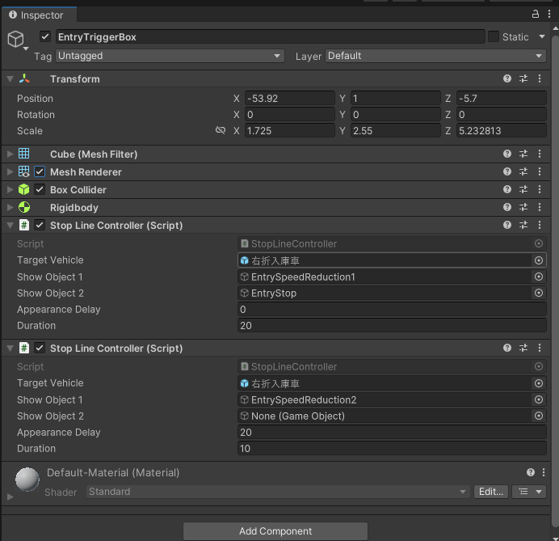

12. さいごに，上記で追加した全てのオブジェクトのMesh Rendererのチェックを外して，透明化させます．

    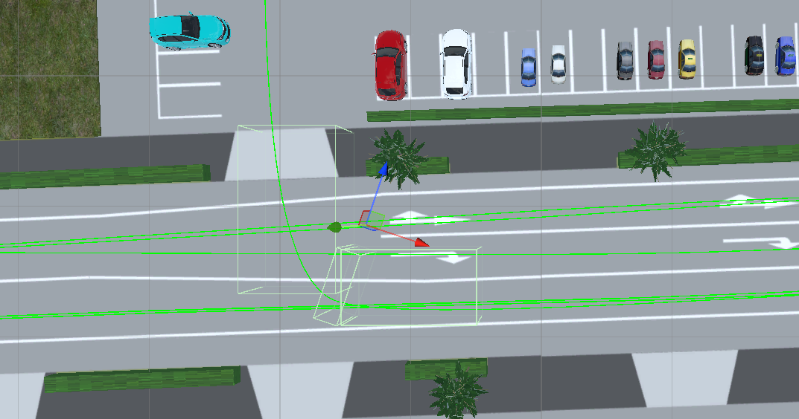