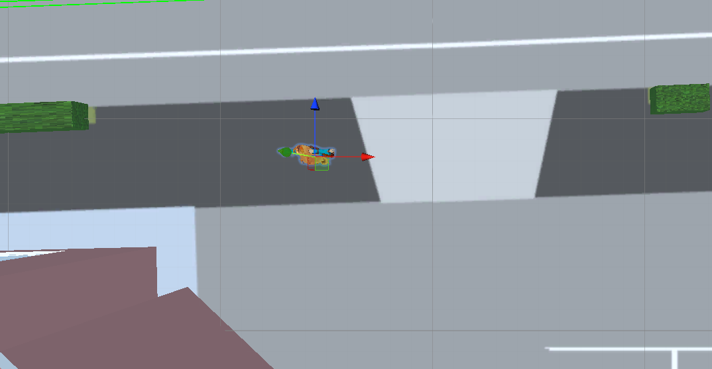
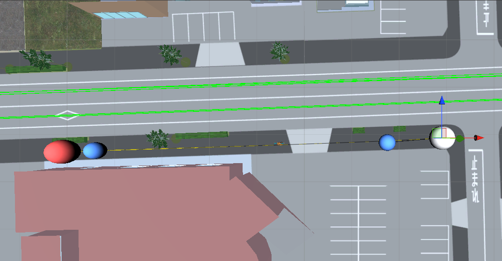
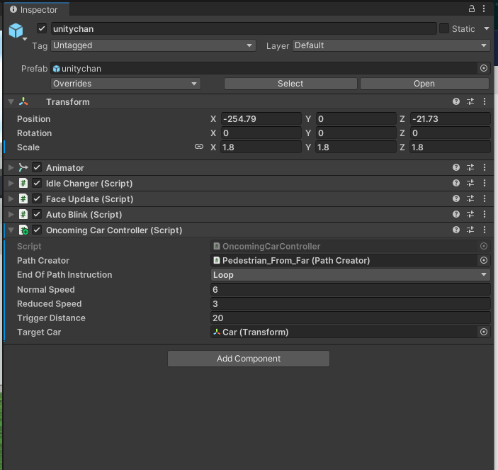
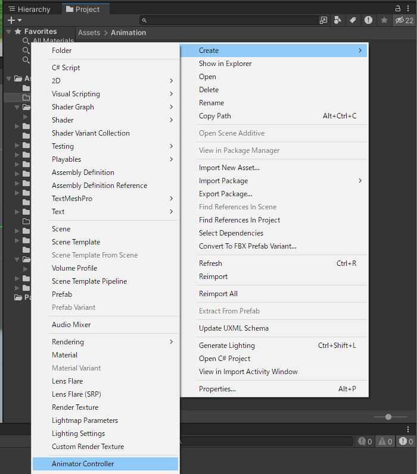
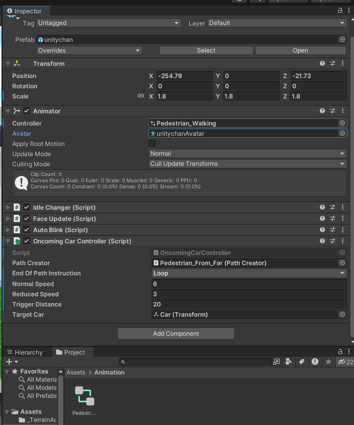
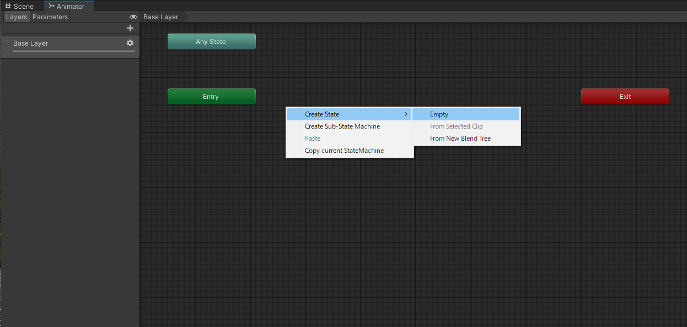
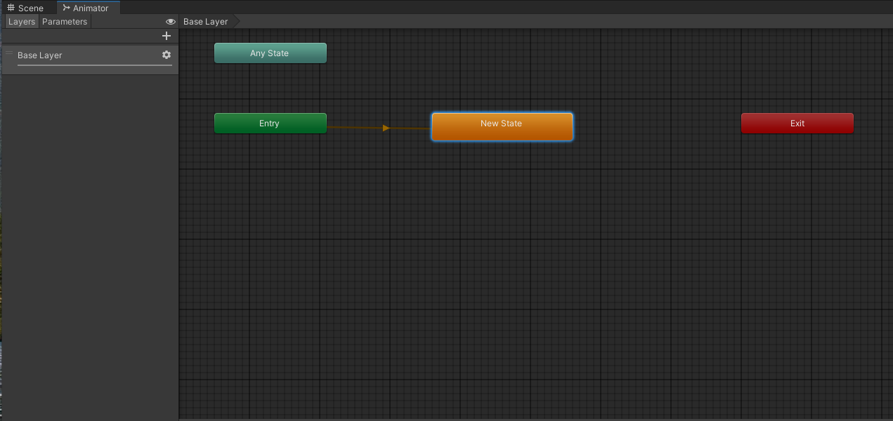
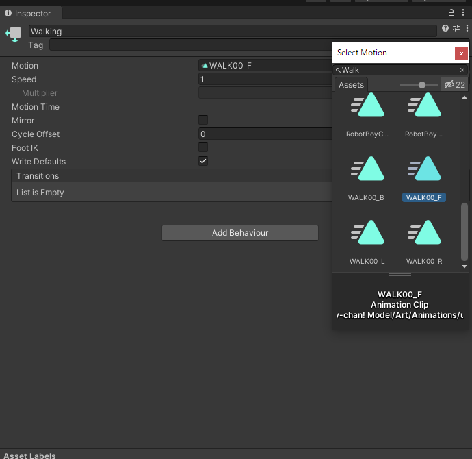
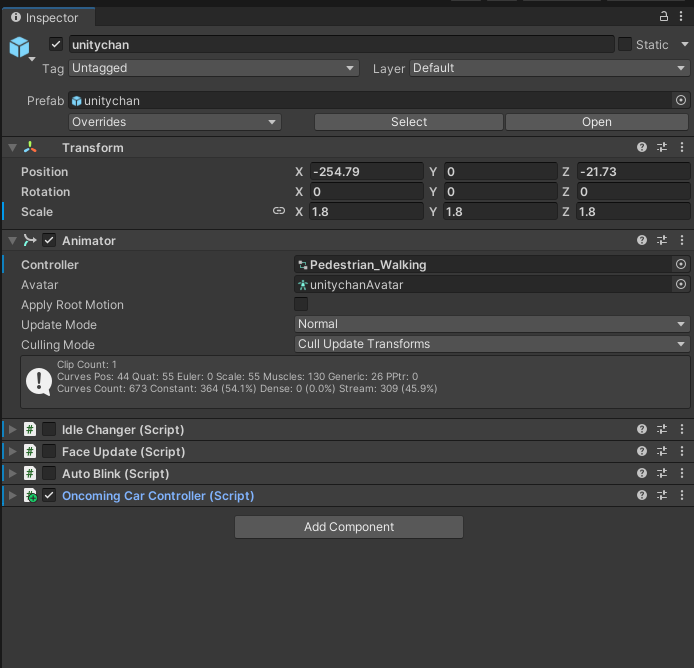

# 歩行者

本記事では[3-1の記事](./3_1.md)，[3-4の記事](./3_4.md)の応用として，他車ではなく，歩行者を指定経路に沿って移動させたいと思います．

## この記事で説明すること
この記事では以下を説明します．
- 歩行者のアセットの追加方法
- 歩行者の移動経路の作成方法
- 歩行者に自然に足踏みさせる設定方法

## 参考サイト

> [【第一弾】Unityでキャラクターを歩かせよう！【2025年版実装方法解説】](https://techchance.jp/blog/2022/02/20/unitywalking01/)

## 手順
### 歩行者の移動設定
1. まずは，歩行者のプレハブを追加します．今回は，[Unity-Chan! Model](https://assetstore.unity.com/packages/3d/characters/unity-chan-model-18705#description)を使用します．アセットストアからダウンロードし，シーン内に配置します．

    

2. [3-1の記事](./3_1.md)と同様の方法で歩行者の移動経路を作成します．

        

3. [3-4の記事](./3_4.md)で作成したOncomingCarController.csを追加したUnity-Chan! Modelにアタッチします．下の画像の設定では，移動速度を6km/h，自車との距離が20mになったら，動き出すように設定しています．

    

### 歩行者の足踏み設定
1. Projectウィンドウ上で右おクリックして，`Create` > `Animator Controller`を選択して，新規アニメータコントローラを作成します．名称は適当なものを設定します．

    

2. Unity-Chan! ModelのInspectorウィンドウを開きます．AnimatorコンポーネントのControllerに，1. で作成したAnimator ControllerをProjectウィンドウからドラッグ&ドロップして，アタッチします．

    

3. Projectウィンドウに戻り，作成したアニメータコントローラを選択して，Animatorウィンドウを立ち上げます．

4. Animatorウィンドウ上の余白で右クリックして，`Create State` > `Empty`を選択します．

    

5. 新規状態が作成されます．他のオブジェクト等と同様に，選択するとInspectorウィンドウが立ち上がり，諸設定を行うことができます．

    

6. Inspectorウィンドウでモーションの設定を行います．Motionのプルダウンメニューから，`WALK00F`を選択します．

    

7. さいごに，不要なコンポーネントはチェックを外して無効化しておきます．

    

以上で，任意の移動開始タイミングと速度で，足踏みをしながら，指定経路上を移動する歩行者が再現できました．