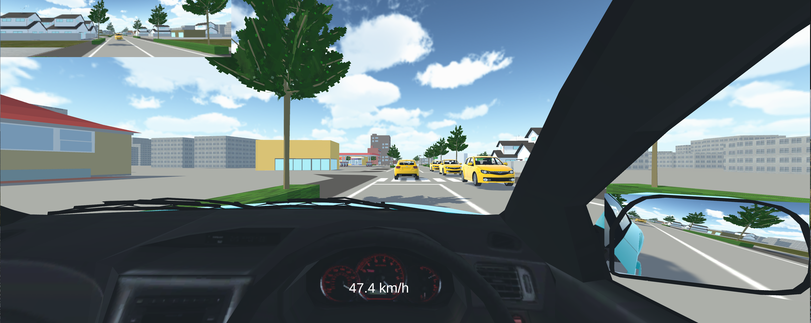

# 実在街路を模造した簡易なドライビングシミュレータの構築

本記事では，簡易なドライビングシミュレータを構築する方法を整理します．

<blockquote style="border-left: 5px solid #4caf50; padding-left: 10px; background-color: #f9f9f9;">
  <strong>📄 Citation</strong> 
  こちらの記事を参考にされた際には，以下の文献を引用してください． 
  <em>植田真生史・中西航, 2025.</em> 
  <a href="">https://doi.org/hogehoge/fugafuga</a>
</blockquote>

## はじめに

ドライビングシミュレータには，没入感の高さや実験条件の制御の柔軟性などの観点で利点があります．
しかし，ドライビングシミュレータの構築や運用には，設置空間，コスト，技術の観点で課題があります．
一般に，ドライビングシミュレータは，
- (a) 設備が大規模で，
- (b) 導入コストが高額です．
- (c) また，高度に専門的で熟練者しか扱えません．

そこで，本記事では，(a)と(b)の課題を回避するために，小規模かつ，低コストでドライビングシミュレータを構築します．
また，その構築方法を詳細に記述し，上記の課題(c)を解消します．

## 構築するドライビングシミュレータの概要

構築するドライビングシミュレータは，以下の特徴を有しています．

<ins>設備が小規模</ins>
    <dd>構築するドライビングシミュレータは，PCにモニタとハンコンを接続したのみで，設備は小規模です．また開発環境にUnityを用いています．
    </dd>    

<ins>実在する街路を模造</ins>
    <dd>構築するドライビングシミュレータの走行環境として用いる仮想空間は，実在する街路を模造したものです．そして，路面標示や沿道の建築物，道路付属物を任意に変更可能とします．
    </dd>

<ins>ハンドルコントローラの操作と連動</ins>
    <dd>仮想空間内に配置された自車は，現実空間の被験者のハンドルコントローラの操作に合わせて走行させることができます．
    </dd>

<ins>バックミラーの設置</ins>
    <dd>仮想空間内に配置された自車には，バックミラーを設置し，後方確認が行えるようにします．</dd>

<ins>他車の自動走行</ins>
    <dd>仮想空間内に配置された他車は，任意の設定で自動走行します．それらは，台数と挙動(走行経路，走行速度，車間距離)を任意に設定可能とします．</dd>

<ins>信号現示の制御</ins>
    <dd>交差点の信号現示も任意の設定で制御できるようにします．具体的には，自車が任意の地点を通過すると切り替わり始め，各現示が任意の秒数だけ点灯するように設定します．</dd>

## 前提知識

構築するドライビングシミュレータでは，Unityを用います．
そのため，Unityに関するいくつかの前提知識を習得しておいていただくと，以降のマニュアルをスムーズに読み進めていただくことができます．

### Unityの基本

Unityのインストールやエディタの基本的な使い方，オブジェクトの基本操作については，下記の記事をご覧ください．
> [Unity Unity基礎 前編：初心者向け完全ガイド – Unityのインストールから基本操作まで](https://styly.cc/ja/tips/unity-basics-part-1-complete-guide-for-beginners/#i-3)

### アセット

[アセットストア](https://assetstore.unity.com/?srsltid=AfmBOopswtLso9-De5K-IECUpYFvg1A_VszKzCsEyC_G6K3MHeqK3rjS)とアセットストアから持ってきたモデルのインポートの方法については以下の記事をご覧ください．
> [【Unity 入門】Unity アセットストア（Asset Store） とは？使い方解説](https://styly.cc/ja/tips/asset-store/)

Unity外で作成されたアセット(インターネット上で配布されている3Dモデル等)を取り込む方法については以下のページをご覧ください．
> [アセットのインポート](https://docs.unity3d.com/ja/560/Manual/ImportingAssets.html)

### スクリプトによる制御

C#スクリプトを用いたオブジェクトの制御については以下の記事をご覧ください．
> [Unity C#スクリプトの構造　スクリプトの作成と実行方法](https://feynman.co.jp/unityforest/unity-introduction/unity-csharp-programming/making-unity-csharp-script/)

### フォルダの作成

大きなプロジェクトになってくると適切なディレクトリ構成でわかりやすくファイルを管理することが重要になります．
ディレクトリ構成の例は以下の記事をご覧ください．
>[Unityのフォルダ構成について考えてみる](https://r-ngtm.hatenablog.com/entry/2017/12/19/225951)

>[Unityフォルダ構成のルールについて](https://qiita.com/takish/items/8608ba9070755da3ae6d)

### 親オブジェクトと子オブジェクト

オブジェクトには親子関係を設定することができます．
親子関係については以下の記事をご覧ください．
> [VRChat初心者に贈る、Unityの親子関係・階層について](https://note.com/watahumi_mina/n/n9b11dcb1b7f0)

### トリガーとは

一連の記事の後半では，Unityのトリガー機能を多用します．
このトリガーに関しては以下の記事をご覧ください．
> [【Unity】OnTriggerを利用した当たり判定を理解しよう！](https://xr-hub.com/archives/7499)

> [【Unity】当たり判定を一通り!OnTrigger・OnCollisionをひとまとめ](https://www.sejuku.net/blog/83742)

## 各記事へのリンク
では，実際にドライビングシミュレータを構築していきましょう．
以下の各記事をご覧ください．

1. 街路の模造
    1. [QGISで航空写真を分割](./MarkDown_Materials/1_1.md)
    1. [路面標示の再現](./MarkDown_Materials/1_2.md)
    2. [建築物と道路付属物の模造](./MarkDown_Materials/1_3.md)
2. 自車の準備
    1. [自車の挙動とハンコンの入力の連動](./MarkDown_Materials/2_1.md)
    2. [車両インテリアの模造](./MarkDown_Materials/2_2.md)
    3. [表示画面の設定](./MarkDown_Materials/2_3.md) 
3. 他車や信号現示の設定
    1. [走行経路の作成](./MarkDown_Materials/3_1.md)
    2. [先行車の走行設定](./MarkDown_Materials/3_2.md)
    4. [後続車の走行設定](./MarkDown_Materials/3_3.md)
    5. [対向車の走行設定](./MarkDown_Materials/3_4.md)
    6. [信号現示の制御](./MarkDown_Materials/3_5.md)
4. 結果の取得
    1. [車両の移動軌跡の取得](./MarkDown_Materials/4_1.md)